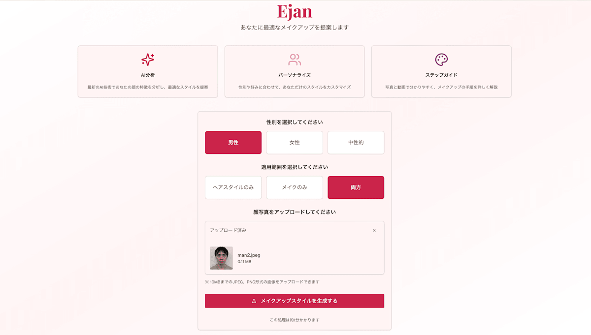
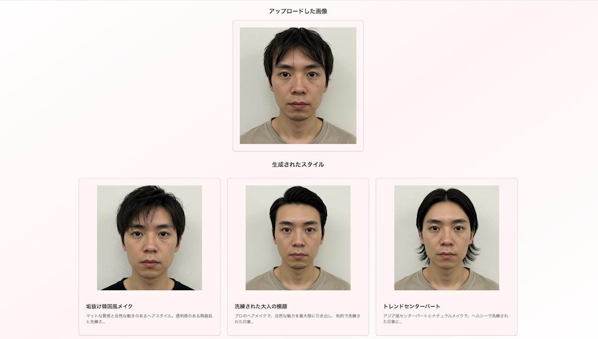
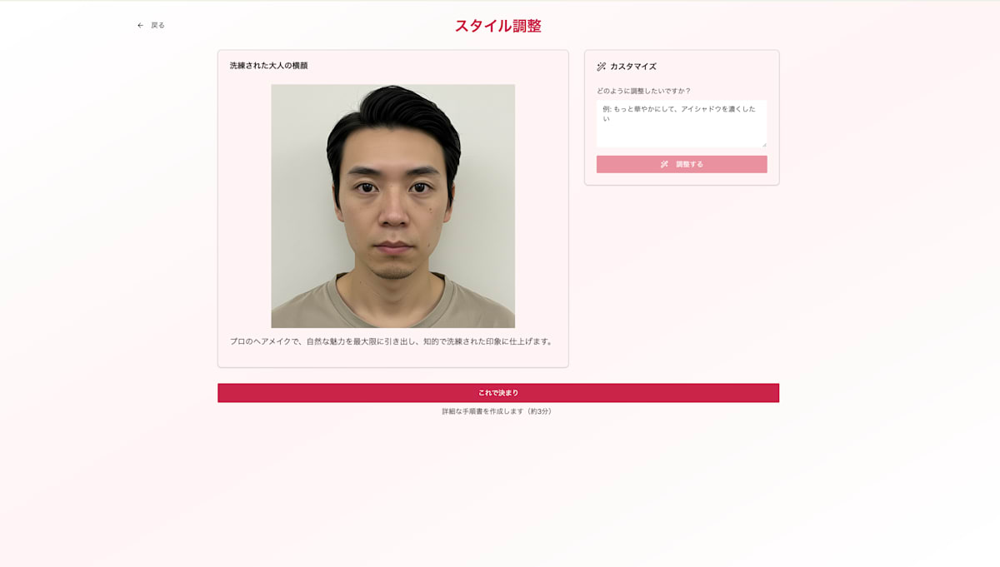
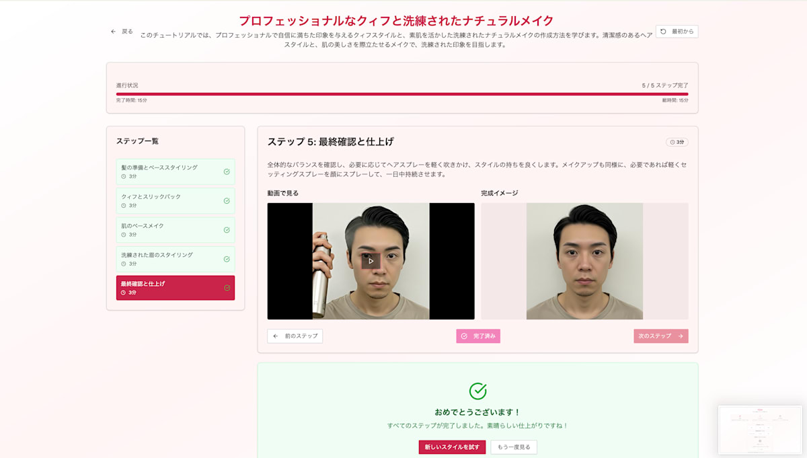
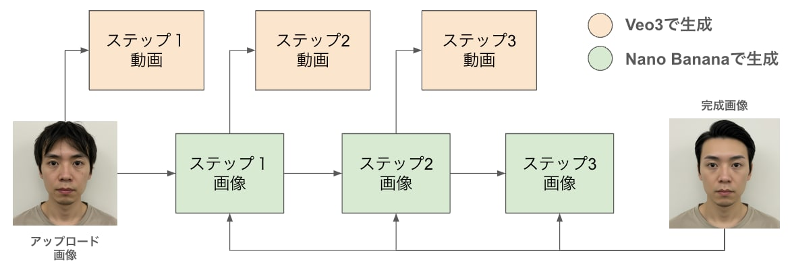
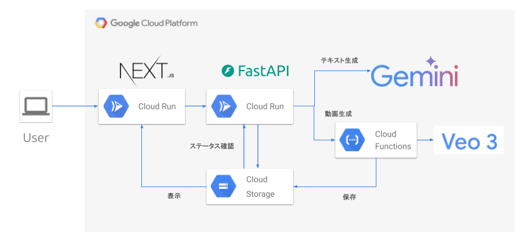

##  デモ動画

<https://youtu.be/WwaNd4fFTOA>

##  GitHubリポジトリ

<https://github.com/takkuhiro/ejan-minimum>

##  1\. はじめに

###  AIが見せる理想と現実のギャップ

突然ですが、皆さんはメイクやヘアスタイリングをする際に、AIは使っていますか？

近年、AI画像生成技術の急速な進化により、理想の自分の姿を驚くほど高精度に生成できるようになりました。SNSで見かける完璧なメイクアップや憧れのヘアスタイル、AIが描き出す理想像を見て、「自分もこうなりたい！」と心が躍ることもあるでしょう。

しかし、ここで新たな課題が生まれています。

**「素晴らしい完成形は見えているのに、どうやってそこにたどり着けばいいのかわからない」**

この課題の深刻さはデータにも表れています。全国調査によると、75.4%の女性がメイクを苦手と感じているという結果が出ています[1]。4人に3人以上が、理想のメイクを実現できずに悩んでいるのです。特に難しいと感じるパーツは、1位が眉（54%）、2位が目元（36.4%）と、顔の印象を大きく左右する部分に集中しています[1]。

###  なぜ従来の学習方法では解決できないのか

これは、AI時代特有の課題ではありません。例えば美容室でプロに素敵に仕上げてもらっても、翌日自分で同じスタイリングを再現しようとすると、なぜかうまくいかない…そんな経験はないでしょうか。実際、2024年の美容室の平均客単価は女性で7,482円[3]、オンラインメイクレッスンは1回1〜2万円[4]と、プロから学ぶにはコストの壁も存在します。

一方、YouTubeなどの無料動画チュートリアルも、実は効果的な学習には課題があります。統計によると、美容系動画の**開始30秒で49%の視聴者が離脱** し、平均再生率はわずか29.5%[5]。つまり、多くの人が最後まで見ずに諦めてしまっているのです。

これらの問題の根本的な原因は、理想の完成形に至るまでの具体的な道筋が見えないことにあります。そして、この課題は日本の化粧品市場が**3兆2,102億円** （2024年）[2]という巨大規模に成長する中で、ますます重要性を増しています。

##  2\. AIスタイルガイド「Ejan（いいじゃん）」

###  コンセプト：なりたい姿への"道筋"を可視化する

Ejanは、理想の姿を見せるだけでなく、そこに至るまでの具体的な道のりを段階的に可視化するAIスタイルガイドとして開発しました。

**Ejanの3つの特徴：**

  1. **段階的なビジュアルガイド**  
完成形までの各ステップを画像で表示し、「今どの段階にいるか」を明確に把握できます

  2. **動画による実践的な説明**  
手の動きや道具の使い方を動画で詳しく解説し、実際の動作を確認しながら学習できます

  3. **パーソナライズ**  
あなたの顔に最適化された、世界に一つだけのチュートリアルを生成します

また、事前に性別（男性・女性・中性的）と変更希望範囲（ヘアスタイルのみ・メイクのみ・両方）を選択することにより、ヘアスタイルのみを行いたい場合や、中性的な印象を与えたい場合などに対応できます。

###  実際の使用例：男性のヘアスタイリング

**Step 1: 写真のアップロード**  
顔写真1枚をアップロードし、性別（男性・女性・中性的）と変更希望範囲（ヘアスタイル、メイク、両方）を選択します。複雑な初期設定は不要です。

**Step 2: AIによるスタイル提案**  
あなたに似合うスタイルを複数提案します。この処理では、Nano Banana (Gemini 2.5 Flash Image) を使ってスタイル画像を生成しています。同時にそのスタイル画像にするための詳細なスタイリングの手順を生成しています。画像生成モデルは世の中に沢山ありますが、スタイリング手順まで生成するためにはこの対話形式でコンテキストを扱うことができるNano Bananaが最適でした。

**Step 3: カスタマイズ**  
「もう少しナチュラルに」「前髪を短めに」など、自然言語での要望にAIが即座に対応し、理想に近づけていきます。ここでもNano Bananaを使って画像編集を行っています。

**Step 4: スタイルガイドに沿った実現**  
選んだスタイルを実現するための詳細な手順が完成します。各ステップの完成イメージ、具体的な説明、実際の手の動きを示す動画がセットで提供されます。詳細なステップは次章で説明します。

##  3\. 技術的アプローチ

###  画像生成と動画生成を組み合わせたスタイルガイドの生成

スタイルガイドの生成では、**Nano Banana (Gemini 2.5 Flash Image)** による画像生成と、**Veo 3** による動画生成を組み合わせています。

画像生成においては、「前ステップの画像」と「最終完成画像」の2枚を入力として使用しています。これにより、現在の状態をベースにしながらも、最終目標を常に意識した自然な画像生成が可能になります。

具体的には、以下の連鎖的な処理により、違和感のない高精度な段階画像を生成しています：

  1. NanoBanana(アップロード画像, 完成画像) → ステップ1画像
  2. NanoBanana(ステップ1画像, 完成画像) → ステップ2画像
  3. NanoBanana(ステップN-1画像, 完成画像) → ステップN画像

Nano Bananaでは複数の画像をコンテキストとして入力できるため、今回の使用方法が実現できました。これが想定された使用方法なのかは確認できませんでしたが、試行錯誤を通じて以下のような実装にしました（実際のコードについてはGitHubリポジトリをご参照ください）：
    
    
    prompt = """\
    提供される2つの顔写真はそれぞれ以下を表します。
    - 最初の画像: メイクアップの途中で前ステップの結果
    - 2番目の画像: メイクアップの最終的な目標スタイル
    
    最初の画像に以下の変更のみを適用した顔画像を生成してください。
    (該当ステップの説明)
    """
    
    response = client.models.generate_content(
        model="gemini-2.5-flash-image-preview",
        contents=[prompt, previous_step_image, final_style_image],
    )
    

####  実装上の工夫

**工夫1: 堅牢なリトライ処理**  
スタイルガイド生成は連鎖的な処理のため、途中でエラーが発生すると全体が正常に生成されません。また、Rate Limitの制約もあるため、処理が中断されないようにリトライ処理を実装しています。

**工夫2: 非同期動画生成によるUX向上**  
各ステップで動画生成を行いますが、すべての完了を待つとユーザー体験が大幅に低下します。そこで、画像生成が完了次第、スタイルガイドを表示する `/tutorial` ページに遷移し、動画は非同期で生成する設計にしました。動画の生成状況は、APIサーバーの `/status` エンドポイントを通じて取得できます。

###  システムアーキテクチャ

  * **Backend: FastAPI (Python)**

AI処理との親和性が高く、非同期処理により複数のAI APIを効率的に呼び出せます。

  * **Frontend: Next.js 14**

React Server Componentsを活用し、画像や動画の重いコンテンツでも高速な表示を実現できます。

  * **AI Services**

スタイルガイド生成時のStructured Outputやテキストの英語翻訳にはGemini 2.5 Flashを使用。画像生成にはNano Banana（Gemini 2.5 Flash Image Preview）、動画生成にはVeo 3を活用しています。

  * **Infrastructure: Google Cloud**

バックエンド・フロントエンドともにCloud Runにデプロイ。処理時間の長い動画生成にはCloud Run Functionsを利用し、インフラ全体はTerraformで管理しています。

####  ユーザー体験を最優先とした設計

ユーザーが用意するのは**顔写真1枚のみ** 。この1枚から、パーソナライズされたスタイル提案、カスタマイズ、そして実現のためのステップバイステップガイド（画像・動画・説明文の組み合わせ）まで、すべてを自動生成します。

複雑な機能を持ちながらも、シンプルで直感的なユーザー体験を実現することを最優先に設計しました。

##  4\. まとめ

AIが生成する美しい理想像は、確かに私たちにインスピレーションを与えてくれます。しかし、それを眺めているだけでは、現実は何も変わりません。AIがどんなに進歩しても、最終的に行動するのは人間です。EjanはAIの創造力と人間の実行力を結びつけることで、誰もが「なりたい自分」になれる未来を実現します。

今回Ejanはメイクとヘアスタイリングに特化していますが、この「理想への道筋を示す」というコンセプトは様々な分野に応用可能です。

  * **ファッション** \- 理想のコーデを実現
  * **インテリア** \- 憧れの部屋を段階的にDIY
  * **料理** \- プロの料理を家庭で再現するための詳細なガイド
  * **フィットネス** \- 理想の体型に向けた個別トレーニング

「いいじゃん！」と思える理想の自分を、自身の手で作り上げる。そんな体験をぜひEjanで味わってみてください。

* * *

##  引用・参考資料

本記事で引用した統計データの出典：

  1. **メイクに関する調査データ**

  * [株式会社YY「メイクのやり方が難しいパーツランキング 女性500人アンケート調査」（2023年）](https://prtimes.jp/main/html/rd/p/000000023.000044061.html)

  2. **化粧品市場規模**

  * [矢野経済研究所「化粧品市場に関する調査を実施（2024年）」](https://www.yano.co.jp/press-release/show/press_id/3627)

  3. **美容室の客単価**

  * [ホットペッパービューティーアカデミー「値上げだけじゃない⁉客単価が過去最高額となる理由は？」（2024年）](https://hba.beauty.hotpepper.jp/search/column/c_price/58173/)

  4. **オンラインメイクレッスン料金**

  * [ライブティーチャーズ「メイクのオンラインレッスン/講座おすすめ8選！費用や特徴を徹底解説！」](https://column.live-teachers.com/a00057/)
  * [カラミラ「【東京】自分に似合うメイクを教えてくれる場所は？おすすめサロンやレッスン、料金相場を紹介」](https://beautystyle.co.jp/colomir/matching-makeup-tokyo/)

  5. **YouTube視聴維持率**

  * [StockSun株式会社「YouTubeの視聴維持率とは？目安や確認方法、低い場合の改善方法を解説」](https://stock-sun.com/column/youtube-audience-retention/)

