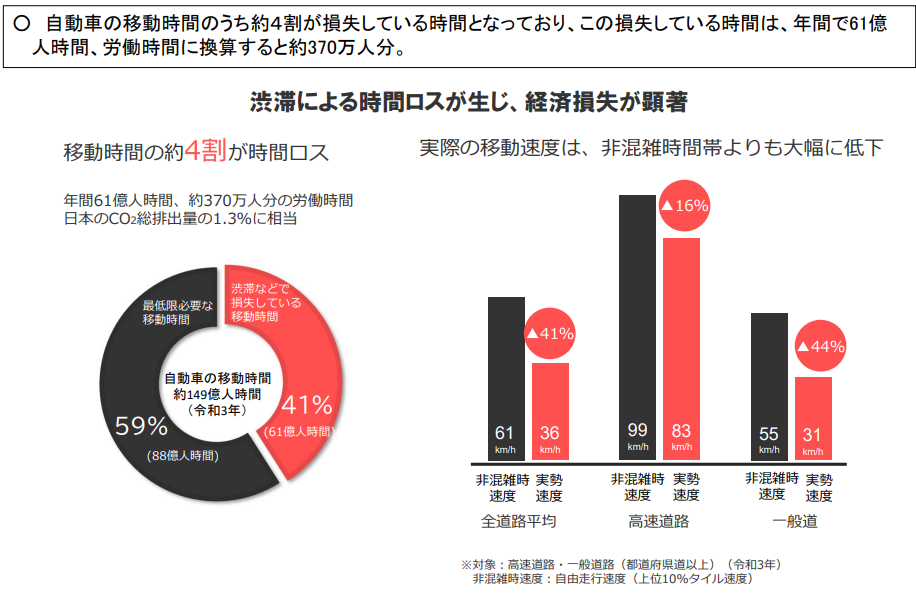
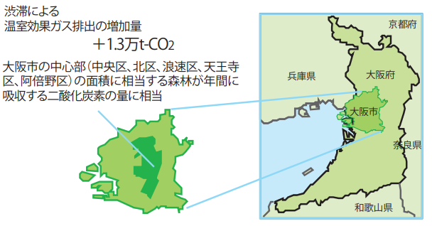
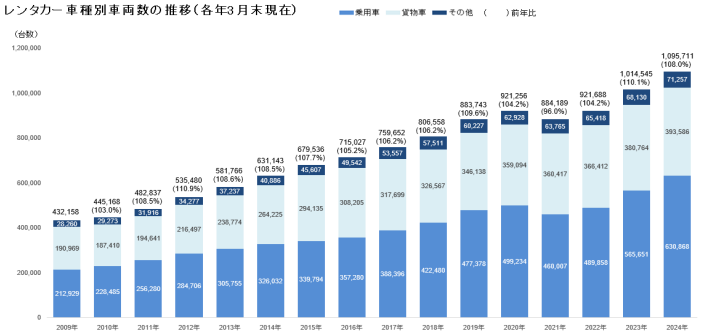
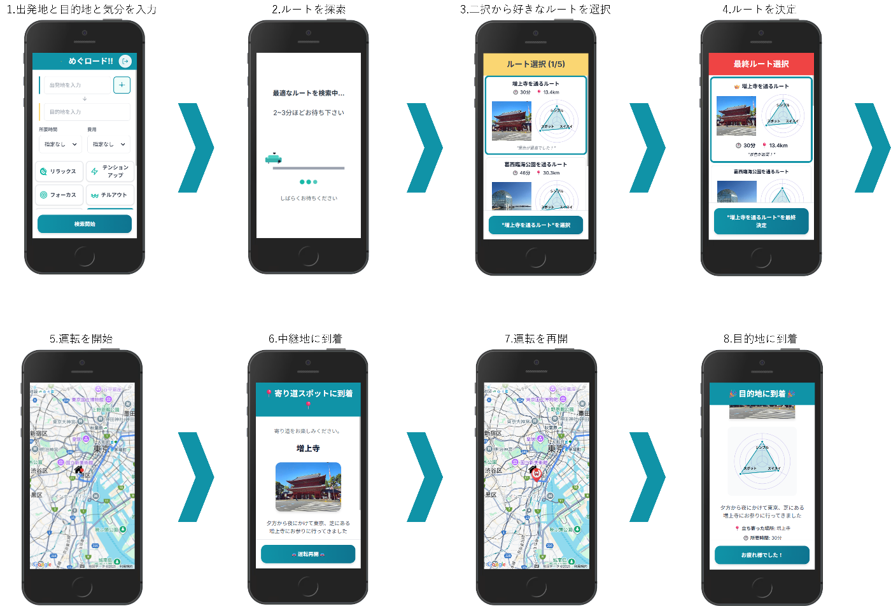
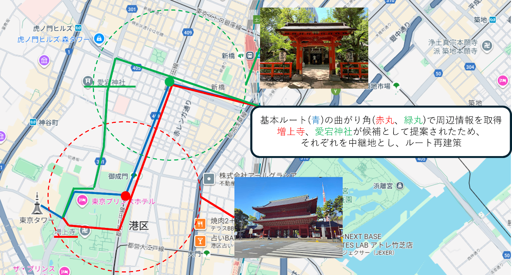
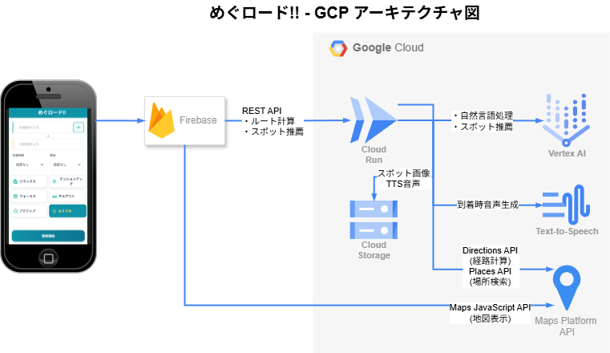

#  動画

プロダクト紹介動画  
<https://youtu.be/36SqR3O4rsM>

#  1.対象とするユーザー像と課題

###  〇対象ユーザー

  * 日常的に車で移動するすべてのドライバー
  * 観光や出張でレンタカーを利用する、土地勘のないドライバー

###  〇現状の課題-渋滞がもたらす影響

  * 経済損失 
    * 自動車移動の**約4割は時間のロス**
    * 年間で61億人時間(労働時間にして370万人分)

  
_参照:<https://www.mlit.go.jp/road/ir/ir-council/buturyu_douro/pdf01/02.pdf>_

  * 環境への影響 
    * **1.3万t-CO₂の追加排出**
      * 大阪市の中心部全域の面積の森林が1年間に吸収する二酸化炭素量

  
_参照:<https://corp.w-nexco.co.jp/csr/backnumber/h19/pdfs/rp07_p07_10.pdf>_

###  〇車社会の動向

  * 自動車所有の高止まり 
    * 車の所有台数は横ばい傾向 
      * 減少には転じておらず、今後も高止まりする予想
    * 自動運転による渋滞緩和 
      * 現状では独立して走ることの実験段階
      * カーナビにおいても最短以外のルート検索が乏しい

  
_参照:<https://www.airia.or.jp/publish/file/hoyuudaisuusuii06.pdf>_

  * レンタカー需要の増加 
    * 保有車両数は増加傾向

    * レンタカー使用者は普段走り慣れない道を走る可能性が高い

→現在のような画一的な「最短」ルートの案内では交通量が1つのルートに集中する恐れ

  
_<https://www.rentacar.or.jp/wp-content/uploads/2024/08/8517a4ef8a4373e65bff17d72056cf4e.pdf>_

###  〇解決に必要なソリューション

###  ・渋滞緩和を自然にうながすルート提案ソリューション

画一的ではない、ユーザーごとに異なる提案によって交通需要を分散させるルート提案が必要

#  2.課題解決のためのソリューション

###  〇めぐロード!!

  * 「寄り道」ルート提案アプリケーション 
    * 最短経路のみではなく、気分に合わせた寄り道を提案

###  〇特徴

  * 個人の気分を基に「最短距離」ではなく「混雑を避ける寄り道」を提案 
    * 単なる最短ルートではなく「気分に合った寄り道」を提案
    * 交通量の分散とドライバー体験の向上を同時に実現
  * ゲーム感覚で自分の気分にあったルートを選択可能 
    * 常に2つの候補ルートを提示し、好みの方を選択
    * 限られた選択を繰り返すことで「今の気分に合うルート」にたどり着ける
  * スマートフォン用に設計された画面 
    * Webアプリとして実装し、専用端末を必要としない
    * レンタカー利用時も自分のスマホとスタンドがあれば即利用可能

###  〇アピールポイント

  * 社会課題と個人的体験の同時解決 
    * 寄り道というシンプルな動作で社会課題の解決と個人の体験の向上を目指すことが可能

#  3.機能

##  3.1 UXデザイン

  * UXデザインはすべてモバイル利用を前提に設計 
    * カーナビ代わりにスマホを使う層にもスムーズに導入可能
    * レンタカーなど既存カーナビにアプリを追加できない状況でも利用可能

##  3.2 UI設計

  * 画面遷移  
1.出発地/目的地と気分を選択する  
2.ルートを探索する  
3.おすすめの道が2つずつ表示されるので気に入った方を選ぶ  
4.候補ルート一覧が表示されるので、最終的なルートを決定  
5.中継地までドライブ  
6.中継地でおすすめ情報を聞いて楽しむ  
7.運転再開し、目的地までドライブ  
8.目的に到着

  
_画面遷移_

##  3.3 バックエンド動作

  * 寄り道を探索  
1.Directions APIで出発地から目的地の基本ルート検索を行う  
2.各地点周辺の寄り道候補を探索（Vertex AI に地点・距離・価格などを自然言語で指定）  
3.挙げられた候補を中継地に設定してルート再検索  
4.レーダーチャートのスコアを算出  
\- シンプルポイント：曲がる回数、直線比率が高い  
\- スイスイポイント：交通量（渋滞量）  
\- スポットポイント：口コミレビュー  
5.集約したルート情報をフロントへ送信

##  3.4 アーキテクチャ図

  
_アーキテクチャ図_

#  4.おわりに

寄り道は毎日の移動を「点から点への移動」ではなくちょっとした体験へと変える可能性を秘めています。  
渋滞によるストレスを寄り道によって豊かな社会へと変えていきましょう！
