##  デモ動画

<https://youtu.be/QtN_4YkG8RI>

##  1\. はじめに

近年、「本が読めない」とお悩みの方は多いようです。  
そんな社会背景を反映してか、昨年は三宅香帆氏の「なぜ働いていると本が読めなくなるのか」がヒットし話題となりました。  
その傾向は具体的な数字にも表れており、文科省の調査[1]によると、「以前と比べて読書量が減っている」と回答した方が、全体の約70%を占めています。  
その原因として最も多く挙げられているのが、「情報機器（携帯電話、スマートフォン等）で時間が取られる」という回答です。  
情報機器は、確かに読書の妨げになります。しかし、テクノロジーの力で、逆に読書を推進するツールにもなるのではないか。そう思って開発したのが、「MAsterpIece」というプロダクトです。  
※MAsterpIeceは、Masterpiece（名作）とAIを掛け合わせた造語です。

##  2\. MAsterpIeceとは

###  2.1 ターゲット

芥川龍之介や太宰治、夏目漱石など、いわゆる文豪が著した「名作」は著作権が切れているものが多く、青空文庫やkindleを通じて、誰でも無料で読むことができます。  
一方で、そういった「名作」を実際に読破しようとすると、様々なハードルがあり、挫折してしまう方も多いです。  
MAsterpIeceは、「**日本の名作を読んでみたいけど、ハードルが高くて手が出せない** 」方に向けたプロダクトとなっています。

###  2.2 課題

「名作は難しい」という印象を持つ方は多いと思います。  
名作を読むにあたっての「難しい」を具体的に分解すると、大きく以下の3要素が課題であると考えられます。

  1. **言語・表現**  
文語体・旧仮名・当時の語彙など、現代では見慣れない文章が多く、頭に入りづらい。
  2. **内容・テーマ**  
当時の価値観や風俗が前提となっている場合、説明なしでは十分な理解が難しい。
  3. **読み手の心理面**  
「名作は難しい・とっつきにくいものだ」という意識がある。

また、「読む」際だけではなく、「**探す** 」際の課題もあります。  
自分の趣味・嗜好に合った作品を、無数に存在する名作の中から見つけ出すのは至難の業です。

###  2.3 ソリューション概要

MAsterpIeceは、AIを活用して上記の課題を解決し、「名作を、気軽に、楽しく」読んでいただくためのソリューションです。

  * 名作を「読む」際の課題に対して、 
    1. 言語・表現がわかりづらい  
→**ここだけ現代語訳** の機能
    2. 内容・テーマがわかりづらい  
→**解説エージェント** によるクイックな解説
    3. 心理的にとっつきにくい  
→**挿絵・動く挿絵** の生成・コレクションによる、より「楽しい」読書スタイルの提案
  * 名作を「探す」際の課題に対して、読書履歴を参照する**司書エージェント** によるレコメンド機能  
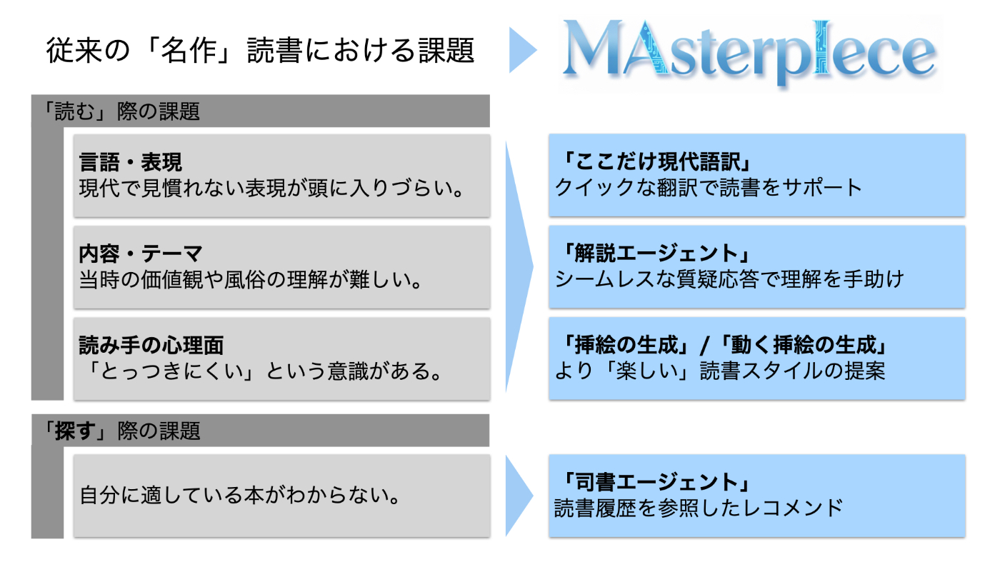

##  3\. 機能

本プロダクトは、大きく「探す」機能と「読む」機能に分かれ、AIによる補助機能が5つあります。

  * 「探す」機能 
    * **司書エージェント**
  * 「読む」機能 
    * **ここだけ現代語訳**
    * **解説エージェント**
    * **挿絵の生成**
    * **動く挿絵の生成**

以降で、それぞれの詳細についてご説明します。

###  3.1 「探す」機能

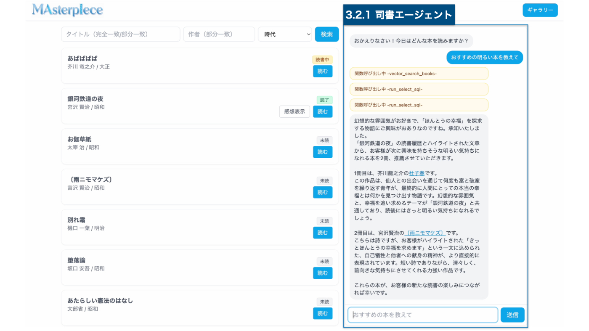  
まずは「探す」機能から、次に読む本を見つけます。  
現時点では、著作権の切れた作品を約200件収録しています。[2]  
目当ての作品がある方は、画面左の検索窓から作品を見つけることが可能です。一方で、目当ての作品はないけど何か読みたい、という方に向けて、「**司書エージェント** 」というAI機能を搭載しています。

####  3.1.1 司書エージェント

画面右側のチャット欄に質問を送ると、AIエージェントがおすすめの本を選び、レコメンドしてくれる機能です。  
AIエージェントは、ユーザーの質問と**読書履歴** （読了済みの本と感想・ハイライトした文章）をインプットとして受け取ります。  
その上で、「本のSQL検索」、「本の概要ベクトル検索」、「段落のベクトル検索」の3つのツールを利用して本を検索し、推薦理由とともにレコメンドします。  
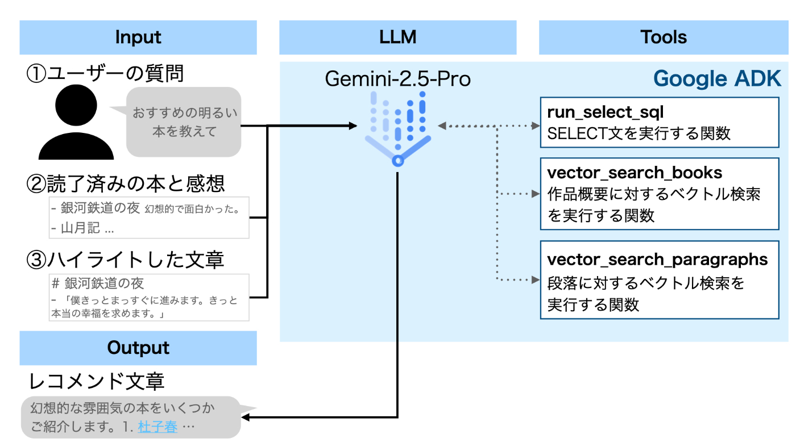

本エージェントは、Python関数を簡単にエージェントのToolに変換でき、かつCloud Runへのデプロイが簡単な、Google ADKを用いて構築しています。

###  3.2 「読む」機能

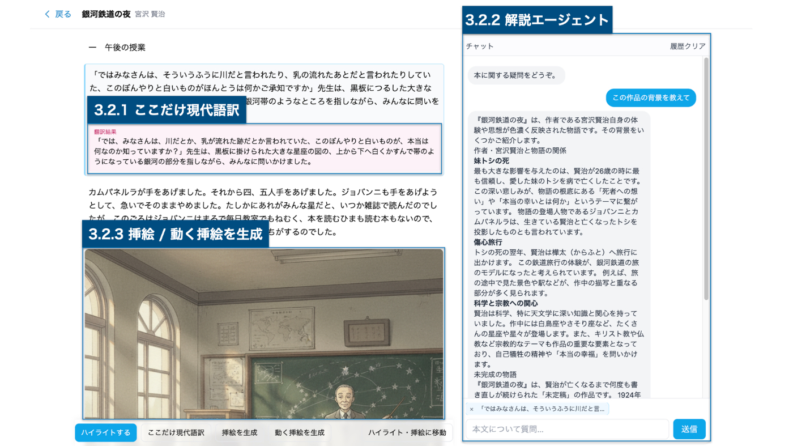

読みたい本を押下すると、「読む」画面に遷移します。  
「読む」画面では、「**ここだけ現代語訳** 」、「**解説エージェント** 」、「**挿絵を生成** 」、「**動く挿絵を生成** 」、と4つのAI機能を利用することができます。

####  3.2.1 ここだけ現代語訳

旧仮名や文語体・知らない語彙など、言語・表現の問題で文章が読みづらい、という場合に利用できる機能です。  
段落を選択し、「ここだけ現代語訳」を押下すると、平易な表現への翻訳結果がクイックに表示されます。  
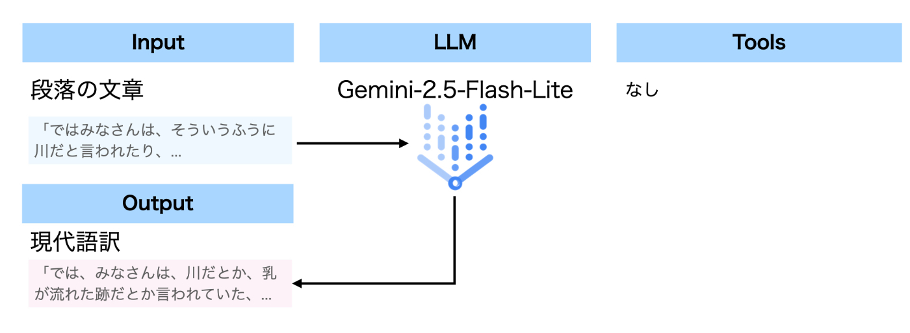

ここでは応答速度を重視し、LLMモデルとしてGemini-2.5-Flash-Liteを使用しています。

####  3.2.2 解説エージェント

物語全体の背景など、内容やテーマに関する疑問がある場合に利用できる機能です。  
質問を入力すると、必要に応じてWeb検索を行いながら回答を生成します。  
また、段落を選択した上で質問をすると、その段落の文章を踏まえた回答をしてくれます。  
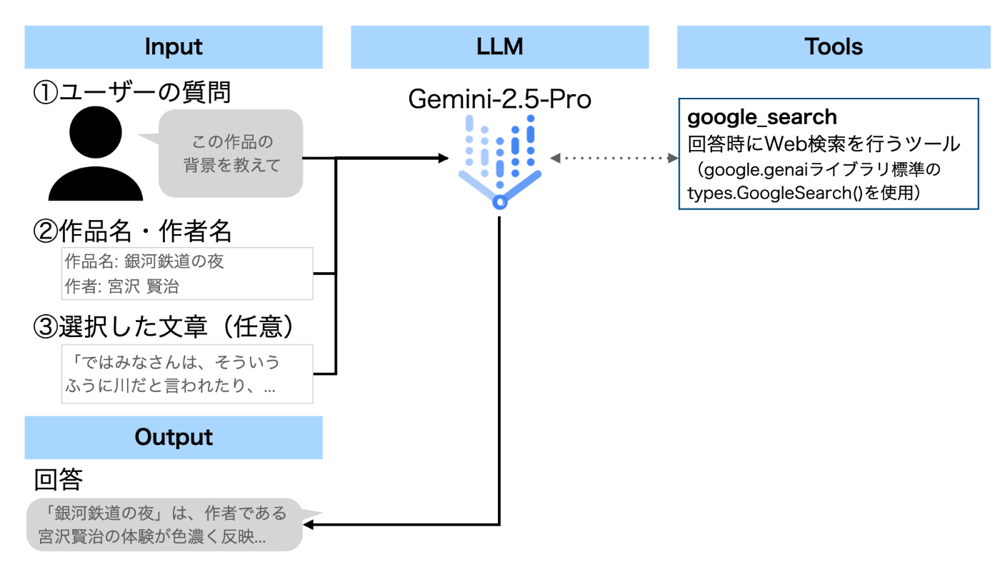

####  3.2.3 挿絵 / 動く挿絵を生成

自分の好きなシーンを、絵や動画にして楽しむための機能です。  
段落を選択し、「挿絵を生成」または「動く挿絵を生成」を押下すると、その文脈に適した画像/動画が生成されます。  
「文字だけでは理解が難しいシーンを図にして直感的に把握する」という使い方はもちろんですが、読書に「**好きなシーンを絵にするエンタメ** 」としての新たな楽しみ方を付与する機能でもあります。

生成した挿絵・動く挿絵は、以下のように「ギャラリー」画面に一覧表示されます。  
自分の好きなシーンを集めたり、見返したり、SNSにシェアしたりと、より「楽しい」読書体験につながります。  
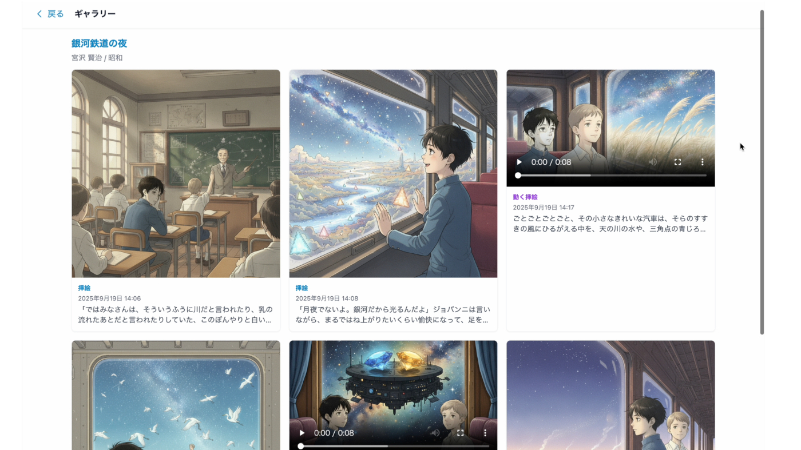

##### 3.2.3.1 挿絵生成の仕組み

挿絵の生成で課題となるのが、「物語内での一貫性」です。  
単純に物語の一文をプロンプトとして画像を生成した場合、文ごとにキャラクターや画風が全く異なる画像が生成されてしまいます。これでは、物語やキャラクターへの愛着が湧きづらくなってしまうことが懸念されます。  
そこで、本アプリでは、以下の4ステップでの挿絵生成を行なっています。

  * 前処理（アプリのデプロイ時に実施） 
    1. 作品ごとに、Gemini-2.5-Flash + Web検索ツールを用いて**主要キャラ特徴一覧** を生成
    2. 1.の情報を用いて、Imagen-4.0-Fastを用いて**主要キャライメージ** を生成
  * 生成処理（ユーザーからのリクエスト時に実施） 
    1. Gemini-2.5-Proを用いて、ユーザーが選択した文章に**登場するキャラクターを判定** \+ **画像生成用のプロンプト** を作成
    2. 1.で判定された登場キャラクターの**キャライメージ** \+ **画像生成用のプロンプト** を、**Gemini-2.5-Flash-Image (nano-banana)に入力して挿絵を生成**  
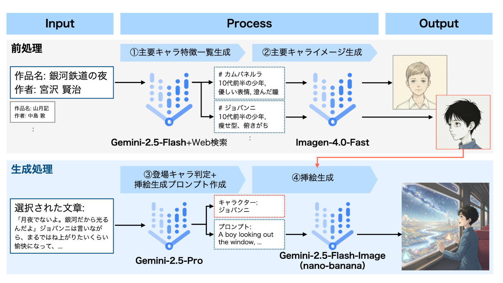

前処理では大量の作品群を処理するため、速度を上げるために速いモデルを利用しました。（本ユースケースでは、精度の高いモデルを利用しても品質にあまり差がなかったことも理由の一つです。）  
肝となる挿絵生成には、元のキャライメージを最も忠実に再現できるモデルである、Gemini-2.5-Flash-Image (nano-banana)を採用しました。

##### 3.2.3.2 動画生成の仕組み

基本は挿絵生成と同じ仕組みですが、nano-bananaに動画の1シーン目画像+動画生成用のプロンプトを同時に生成させ、両者をVeo3に入力することで、動く挿絵を実現しています。

  * 前処理（アプリのデプロイ時に実施） 
    * 挿絵生成と同様
  * 生成処理（ユーザーからのリクエスト時に実施） 
    1. （挿絵生成と同様）Gemini-2.5-Proを用いて、ユーザーが選択した文章に登場するキャラクターを判定 + 画像生成用のプロンプトを作成
    2. 1.で判定された登場キャラクターのキャライメージ + 画像生成用のプロンプトを、Gemini-2.5-Flash-Image (nano-banana)に入力して、**動画1シーン目の画像 + 動画生成用のプロンプト** を生成
    3. **動画1シーン目の画像 + 動画生成用のプロンプト** を**Veo-3.0-Fastに入力し、動く挿絵を生成**  
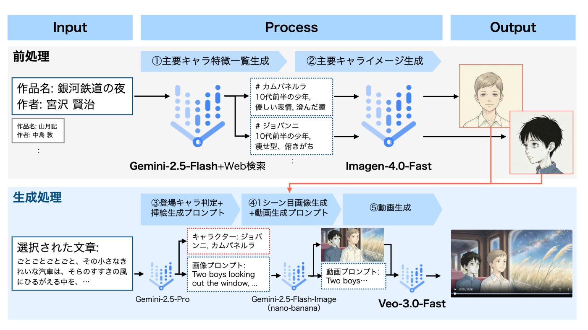

##  4\. アーキテクチャ

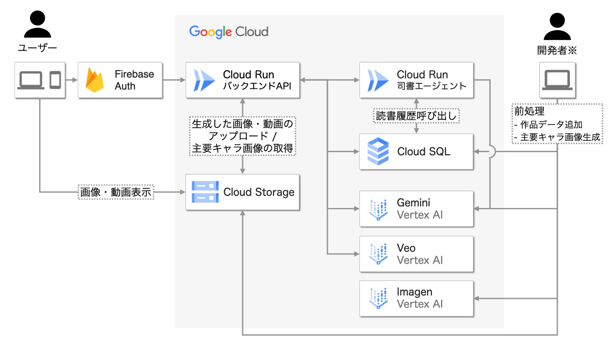

  * フロントエンド 
    * HTML + TailwindCSS + JavaScript
    * レスポンシブ対応によりPC・スマートフォンどちらからの利用も可能
    * Firebase Authを利用し、Google or ゲストユーザ（匿名認証）でログイン
  * バックエンド 
    * APIは、Cloud Run + FastAPI
    * 司書エージェント機能のみ、Cloud Run + Google ADKの別インスタンス
  * データベース 
    * Cloud SQL + PostgreSQL (+pgvector)
  * ストレージ 
    * 生成画像・動画のみを保存しているため、現状は認証なしで公開
    * 正式リリース時には認証保護の導入を検討
  * 前処理 
    * 開発者のローカルPCから、Pythonスクリプトを実行し、作品データ追加・主要キャラ画像生成を実行
    * 前処理用スクリプトをCloud Functionsとしてデプロイすることで、新規作品データ追加の自動化も実現可能

参考：スマートフォンログイン時の画面イメージ  
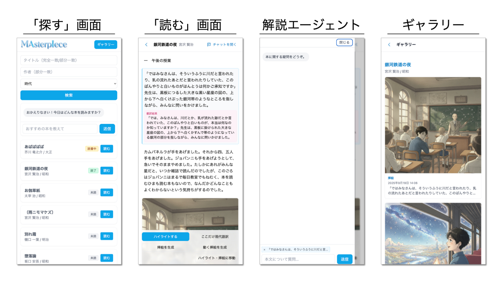

##  5\. 終わりに

読書には、思考力や語彙・表現力を豊かにし、集中力を養うなど、さまざまなメリットがあります。  
そんなメリットを享受するための第一歩は、読書を「楽しい」と感じてもらうことと考えています。  
MAsterpIeceは、名作へのハードルを下げ、「楽しさ」を作り出します。  
この新しい読書体験を、ぜひ楽しんでいただけると幸いです。

* * *

このプロダクトは、第3回 AI Agent Hackathon with Google Cloud応募作品です。

脚注

  1. <https://www.bunka.go.jp/tokei_hakusho_shuppan/tokeichosa/kokugo_yoronchosa/pdf/94116401_01.pdf> 問8・問8付問より引用 ↩︎

  2. [青空文庫](https://www.aozora.gr.jp/)様のファイルを利用規約に基づき利用しています。 ↩︎

