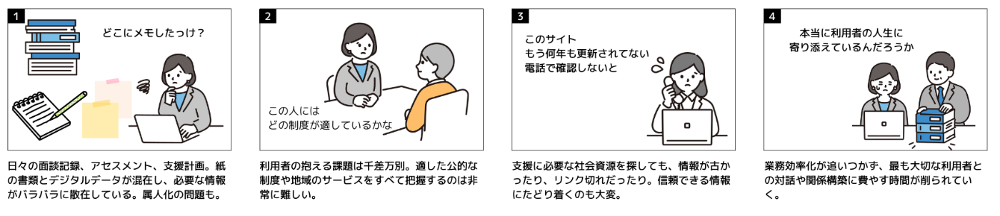
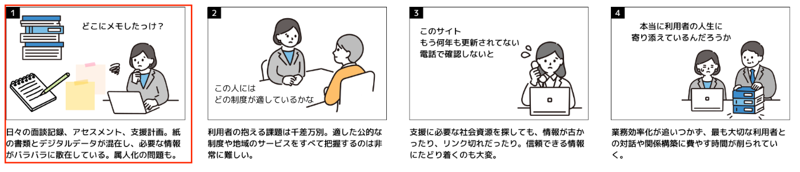
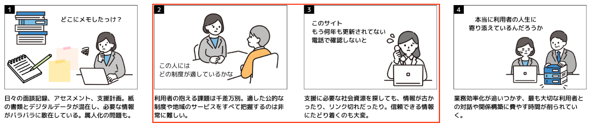
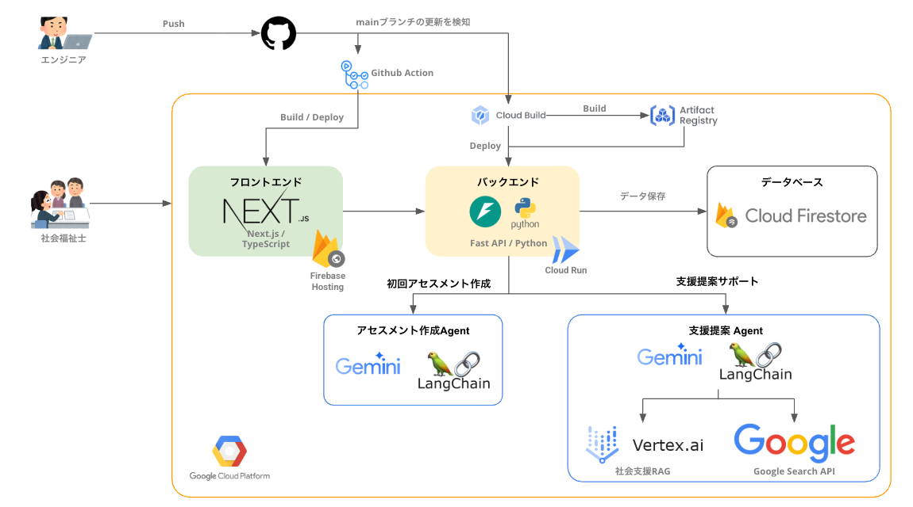
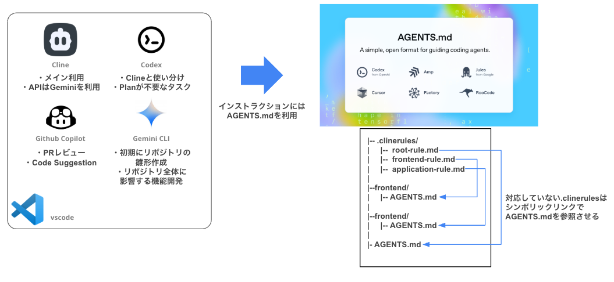

<https://youtu.be/1GEt5MsVObQ>

##  背景

チームメンバーの母は山形県で社会福祉士として働いています。  
もともとは別の仕事を行なっていたのですが「困っている人を助けたい」の志を元に、社会人ながらも大学へ入学し、資格を取得して社会福祉士となりました。

社会福祉の仕事にやりがいを持つ一方、現場では以下のような課題に直面していると伺いました。

  * 依頼者一人一人の人生に寄り添った支援が難しい
  * 支援制度も日々更新されていくため、それを追い続けるのが難しい
  * 人材不足による業務負荷

現場では非常に多忙ながらも、社会福祉士の方は常に利用者一人一人に向き合い「この人にはどういう支援をしたらいいだろう」といったことが話し合われてます。

利用者の中には適切なサポートやアドバイスを受けられ、社会に復帰できた人が多くいます。支援業務では、利用可能な制度を提案するだけでなく、社会福祉士の方が利用者一人ひとりに向き合うことで元気をもらい、社会に復帰できた方もいると思っています。

ヒアリングの過程で、社会福祉士の業務は常に人対人であり「支援が必要な人に向き合う」部分は AI に代替できないと感じました。

そこで今回は **「社会福祉士が利用者を支援するために必要な業務の課題解決」** に着目しました。

##  課題

以下の図は、社会福祉士の方にインタービューをして判明した業務フローにおける困りごとです。

課題を整理すると **「アセスメントの作成/管理業務(図中 ①)」** と **「人に合わせた支援制度の提案の難しさ(図中 ②③)」** が存在し、結果 **「社会福祉士が利用者に寄り添える時間が減っている(図中 ④)」** が発生していると考えました。

###  課題 1: アセスメントの作成/管理業務

社会福祉士の業務の一つにアセスメントの作成業務があります。

アセスメントは、利用者の方のプロフィールや健康状態を記した資料で、社会福祉士の方はアセスメントを元に支援制度を提案します。

アセスメントの作成は、以下の手順で実施されます

  1. 利用者の方が初めて訪れたときに、社会福祉士の方が「初回アセスメント」としてヒアリング
  2. 社会福祉士の方が、メモと記憶を頼りに紙のアセスメントシートに転記
  3. 利用者の方が次に訪れたとき、社会福祉士の方がアセスメントシートを元にして再度ヒアリング

アセスメントシートには非常に多くの項目があり、ヒアリング結果を転記するだけでも非常に多くの時間を費やします。

具体的には**利用者一人当たり、30 分以上の時間を費やす** という現状もあります。

また、アセスメントシートが紙とデジタルバラバラに管理されている現場もあり、業務の属人化の問題も発生しています。

###  課題 2: 人に合わせた支援制度の提案の難しさ

社会福祉士の業務の一つに「利用者に合った支援制度の提案」があります。

利用者の方の状況にごとに適応可能な支援制度や必要としている支援が異なっており、利用可能な支援制度の中から適切な支援制度を探すのも簡単でありません。

また支援制度は自治体によって異なっており、それも定期的なサイクルで情報が更新されます。それらの多くが PDF や紙媒体で管理されており、検索することも容易ではありません。

また自治体によっては更新されていないケースも多く、見つけた支援制度も「情報が古く情報が変わっていた」ということも発生しています

##  目的: 社会福祉士の業務をサポートし、支援が必要な多くの人の現実を豊かにする

私たちは **「社会福祉士の業務をサポートし、支援が必要な多くの人の現実を豊かにする」** を目的にしています。

これ実現するためにフクシアでは社会福祉士の方の業務のうち、2 つの業務をサポートします。

  * アセスメント作成業務
  * アセスメントから利用者が利用可能な支援制度の検索・提案業務

##  プロダクト詳細

###  利用シナリオ

私たちのサービスの利用シナリオは以下の通りです。 **アセスメント作成** と **利用者が利用可能な支援制度の提案** の際に本サービスを利用することを想定しています。

###  機能 1: 「アセスメント作成 Agent」がアセスメント作成の簡略化

利用者 1 人辺り 1時間〜2時間かかっているアセスメント入力業務を**「アセスメント作成 Agent」**が簡略化します。

社会福祉士が利用者と初めてやり取りするとき、まず面談を行い、その利用者の情報を記録した「アセスメント」を作成します。

このエージェントは社会福祉士と利用者の会話ログを解析し、自動でアセスメント項目を埋めます。

<https://youtu.be/1GEt5MsVObQ?t=74>

アセスメント作成 Agent の処理フローは以下の通りです。

アセスメント作成 Agent により、初回のアセスメント作成にかかる時間を大幅に削減します。

###  機能 2: 「支援制度提案 Agent」がアセスメントから利用者が利用可能な支援制度を検索・提案

初回アセスメント実施後、社会福祉士は、利用者の状態からその人に向けた支援プランを検討します。支援制度提案 Agent は業務を大幅に支援します。

<https://youtu.be/1GEt5MsVObQ?t=112>

社会資源 RAG(後述)が作成されており、支援制度提案 Agent が RAG から支援制度を検索し活用します。

さらに現在は Mock ではありますが、登録後関係各所に連絡する機能を備えており、社会福祉が支援制度を利用する時のコミュニケーションコストを削減します。

支援制度の提案は、以下の流れで行われます。

  1. 利用者のアセスメント情報を取得
  2. 社会支援 RAG を検索して、利用可能な社会支援を取得
  3. (必要に応じて)Google Search を利用して、補足情報を取得
  4. 情報を元に、利用者に適した支援プランをタスクとして生成
  5. 回答を返す

Agent の処理フローは以下の通りです。

支援制度提案 Agent を利用することで、利用者に適した社会資源の検索を助けるだけでなく、タスク化することで社会福祉士の方のタスク管理のサポートを行います

###  機能 3: アナログな現場環境にも導入可能な UX

本プロダクトは IT に親しみがない現場でも導入しやすい、わかりやすいシンプルな UX を提供しています。

社会福祉士の方が本プロダクトで行うの作業は２つのみです。

  * 利用者のアセスメントの入力
  * 面談の時のメモの入力

基本的い入力した内容を元に AI Agent が自律的に必要なタスクを提案したり、追加で必要な情報を自動でヒアリングをしたりしてくれます。

タスク管理の機能も備わっており、多くの利用者を抱える社会福祉士のタスク管理をサポートします。

##  システムアーキテクチャ

本プロダクトは以下の Github で管理されています

<https://github.com/teritamas/fukushia>

###  全体構成

全体像は以下の通りです。

コストを最小限に抑えつつ、PoC のリリースと FB のループを高速に回せるような技術スタックの採用と構築を行いました。

###  Clouad Run / Firebase Hosting を利用した最小コスト構成

フロントエンドとバックエンドの実行環境に Cloud Run と Firebase Hosting を利用しています。

Cloud Run はリクエスト発生時にのみ起動する設定にすることで、利用者がいないときは 0 円でサーバーを維持することができます。

Firebase Hosting も 10GB/月の範囲まで無料枠が適応されるため、本ハッカソンのデモ環境としての運用では最小限のコストで運用ができています。

上記 2 つを利用することで、PoC フェーズのサーバーコストの削減をすることができています。

###  Vertex AI RAG Engine を利用した RAG 構築

Vertex AI RAG Engine を利用して社会資源 RAG を構築しています。

Vertex AI RAg Engine を利用することで簡単に RAG の環境を構築することができました。素早い構築と API での利用しやすさ、利用可能なデータソースの豊富さが機能としてあり、PoC のユースケースを検証するための RAG 基盤として非常に有用だと考えています。

###  Cloud Build と Github Action を利用した CICD

Github のリポジトリの main ブランチに更新が入るたびに、即座にデプロイされるように CI/CD を構築しています。

Github Action によるフロントエンドのデプロイと Cloud Build を利用したバックエンドのデプロイパイプラインを構築しました

これにより作成したデモを即座に社会福祉士の方に触ってもらえるようになり、高速な FB ループを実現できました。

###  山形県の社会資源 RAG の作成

ハッカソンの副産物として作成者の地元である山形県の社会資源 RAG を作成しました。

当初このサービスを開発する際、山形県の地域資源マップを AI Agent の Web 検索で自動で取得することを検討していました。

<https://www.pref.yamagata.jp/090002/korei/tiikishigenmap.html>

ところが、開発中に以下の課題に直面しました

  * 参照先のリンク切れが起きている
  * 資料が 10 年以上更新されていない
  * 更新されていても PDF で AI フレンドリーなフォーマットで管理されていない

最終的に全て手動で検索して情報を保管した山形県の社会支援 RAG を独自で作成し、AI フレンドリーなデータ形式にしました。

今後この取り組みを全国に浸透させていくことで、日本全国の社会支援が検索が容易になり、同様の目的を持ったプロダクト開発が容易になると考えています。

###  複数の Coding Agent とインストラクションの共通フォーマットである AGENTS.md の利用

開発プロセスにおいて複数の AI Agent の利用をしています。

  * Gemini Cli: 初期の雛形作成やリポジトリ全体に影響する大規模な機能開発
  * Cline: API に Google Gemini を利用。細かい修正から大規模な機能開発まで幅広くメインで利用
  * Github: Code suggestion によるサポートと PR レビューの実施
  * Codex CLI: 8 月 27 日に vscode 拡張が提供されたので利用。簡単なタスクで Plan が不要なタスクを依頼

複数の Coding Agent の機能を有効に活用するために、インストラクションの共通フォーマットである AGENTS.md を採用しています。

<https://agents.md/>

進化の早い Coding Agent の中で新しい Agent を即座に試すことができ、新しい Coding Agent を採用した場合にインストラクションを新しく作成しなくても、最低限の性能が出るような状態を構築しました。

ちなみに、AGENTS.md に対応していない Cline 等に対しては、`.clinerules`の各ルールを、対応する AGENTS.md に対するシンボリックリンクとして作成することで対応しています。

それにより AGENTS.md を修正した時に`.clinerules`の各ルールにも即座に適応されるようになり、Coding Agent ごとにインストラクションを管理しなければならない手間を解消しています。

##  ユーザーインタビュー

この PoC を元に実際の社会福祉士の方にインタビューを行いました。結果として以下のような好意的な FB をいただけました

  * 面倒なアセスメント入力が簡単に終わって驚いた
  * チャット形式で支援を検索してくれるが良い 
    * そのままタスクとして登録されるので、利用者をいっぱい抱えていても忘れないので良い

一方で、新たな課題も判明しました。

  * 利用者の方と話している最中にチャットに入力したりするのは難しい
  * セキュリティ的に個人情報をインターネット上にアップロードすることは大丈夫かどうか

1 つ目の課題に対しては、音声入力の機能を強化することで解決可能だと感じました。最終的には「社会福祉士の方が利用者の方と話しているだけで、自動で支援制度を自律的に提案してくれるようにする」など、ユーザーが本プロダクトを意識しない UX 設計を検討しています

##  おわりに

今回は、チームメンバーの家族である社会福祉士に全面協力いただき、実際の業務フローを確認しながら本プロダクトの開発を進めることができました。

繰り返しになりますが、社会福祉士の方は常に利用者の方に親身に寄り添っており、この部分は AI Agent にどれだけ大きな技術革新が起きても代替できない部分と感じました。

AI Agent が直接作用しなくても、支援が必要な方がより豊かな現実を過ごせる社会の実現に本プロダクトが少しでも貢献できればと思っています。

!

この記事は[第 3 回 AI Agent Hackathon with Google Cloud](https://zenn.dev/hackathons/google-cloud-japan-ai-hackathon-vol3?tab=overview)提出時の資料です

<https://github.com/teritamas/fukushia>
