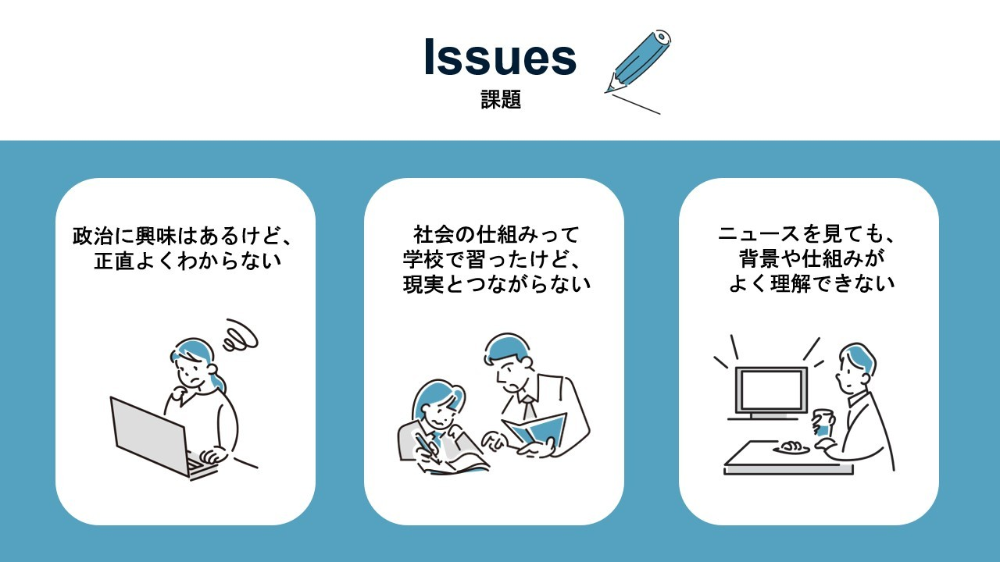
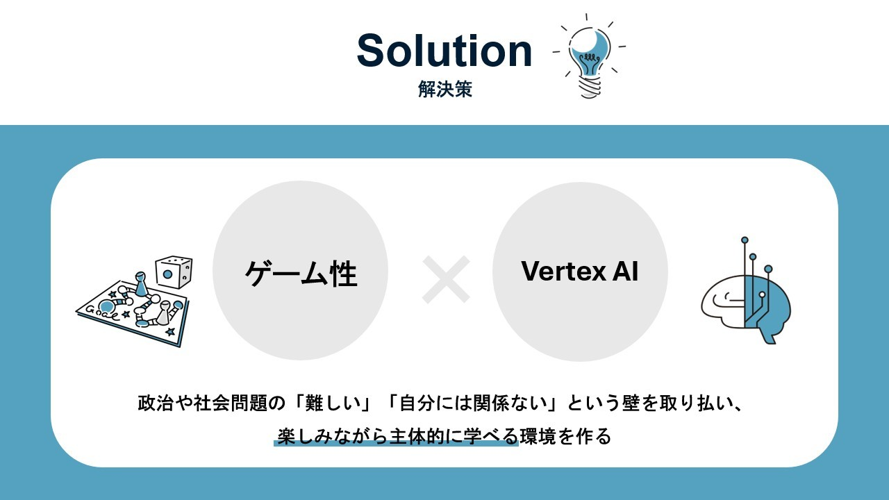
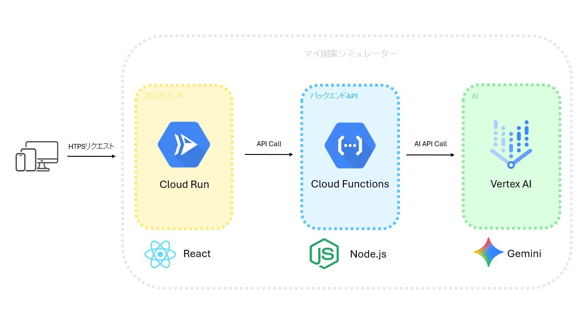

これは【第3回 AI Agent Hackathon with Google Cloud】応募作品です🗳️

#  💡 国を動かし、政治と社会を学ぶ

  
**「政治に興味はあるけど、正直よくわからない」**  
**「社会の仕組みって学校で習ったけど、現実とつながらない」**  
**「ニュースを見ても、背景や仕組みがよく理解できない」**

このような課題を解決するために開発したのが、教育型ゲームアプリ「**マイ国家シミュレーター** 」です。

本アプリでは、プレイヤーが仮想国家の統治者となり、AIとの対話を通じて国を運営します。  
Google Cloudの**Vertex AI** を活用し、多様な市民の声やリアルな政策シナリオを体験しながら、社会問題や政治の仕組みを楽しく学ぶことができます。

まずはデモ動画をご覧ください。  
<https://youtu.be/QFQG7FiESXU>

#  👤 対象ユーザー

こんな方におすすめです：

  * 政治や社会問題に興味はあるものの、難しく感じている**中高生・大学生**
  * 社会科の授業やワークショップで活用できる教材を探している**教育関係者**
  * 政治・経済ニュースをもっと身近に感じたい**一般の方々**

#  📝 課題

多くの人に共通しているのは、**政治や社会の仕組みが“自分ごと”に感じにくい** ことです。  
具体的には、次のような課題があります。

  * 教科書だけでは政治や社会の仕組みが理解しづらく、関心が続かない
  * 現実の政治は複雑で、自分の意見をしっかり形成する機会が少ない
  * 多様な立場や意見を踏まえた意思決定を行う経験が不足している

#  ✅ このアプリで解決できること

  
本アプリは、仮想国家の運営をテーマにゲームの面白さとAIを融合しています。  
**政治や社会問題の「難しい」「自分には関係ない」という壁を取り払い、楽しみながら主体的に学べる環境を作ります。**

  * 抽象的な政治や社会の仕組みを、具体的な国づくり体験として実感できる
  * 一方的な知識の受け取りではなく、AIとの対話を通じて思考を深められる
  * 多様な立場や意見を踏まえ、自分で意思決定する力を鍛えられる

#  📌 このアプリの特徴

###  1\. 実際に体験しながら学べる仕組み

プレイヤーは仮想国家の統治者として政策を選択し、国を運営します。ゲームを通じてリアルに体験しながら理解することができ、ニュースや現実の問題とつながる学びが深まります。

###  2\. AIがリアルな国づくりをサポート

Vertex AIが現実的な政策課題や市民の声を生成し、国の運営にリアリティと多様性を与えます。これにより、臨場感ある国政体験ができます。

###  3\. いろんな人の意見に触れられる

AIが多様な立場や考え方の市民の声をシミュレートし、ひとつの視点に偏らず幅広い意見を知ることができます。

###  4\. 自分の選択が国の未来を左右する面白さ

幸福度や経済などの結果が数字で見えるので、自分の決断がどんな影響を与えるかを実感しやすく、ゲームとしての楽しさも味わえます。政策の選択によって幸福度や経済指標が変動し、学びが数値で可視化されます。

###  5\. 学校やワークショップでも使いやすい

授業やグループディスカッションの素材としても使えて、みんなで考え話し合う学びの場をつくるのに適しています。

###  【番外編】 国旗がカスタマイズできる

国名だけでなく国旗も自分で設定することで、愛着が湧き楽しくプレイすることができます。個人的に一番気に入っているポイントです。

#  💻 システムアーキテクチャと技術選定

  
_システムアーキテクチャ図_  
Google Cloud Platformの主要サービスを活用したサーバーレスアーキテクチャを採用し、手軽でシンプルかつコスト効率の高いシステムにしました。

###  技術スタック

  * フロントエンド：React / TypeScript / Cloud Run
  * バックエンド：Node.js / Cloud Functions
  * AI連携：Vertex AI

#  ☁️ 今後の展望

次のような追加機能を検討しています：

  * **時事ニュースと連動した政策イベントの追加：**  
最新の社会動向やニュースを反映した政策シナリオを実装し、よりリアルでタイムリーな国づくり体験を目指します。

  * **マルチプレイヤーモード（他プレイヤーとの外交や貿易）：**  
複数のプレイヤーが国家を運営し、外交や貿易などのやり取りを行うことで、より複雑でダイナミックな政治体験を提供します。

  * **教育機関向けのカスタムシナリオ配信：**  
学校や教育機関のニーズに合わせたシナリオを作成・配信し、授業やワークショップでの活用を促進します。

#  ✏️ 最後に

ハッカソン初参加で緊張しています。

このハッカソンがVertex AIを活用した開発に挑戦するいい機会となりました。  
Cloudの$300の無料クレジット様様です。
