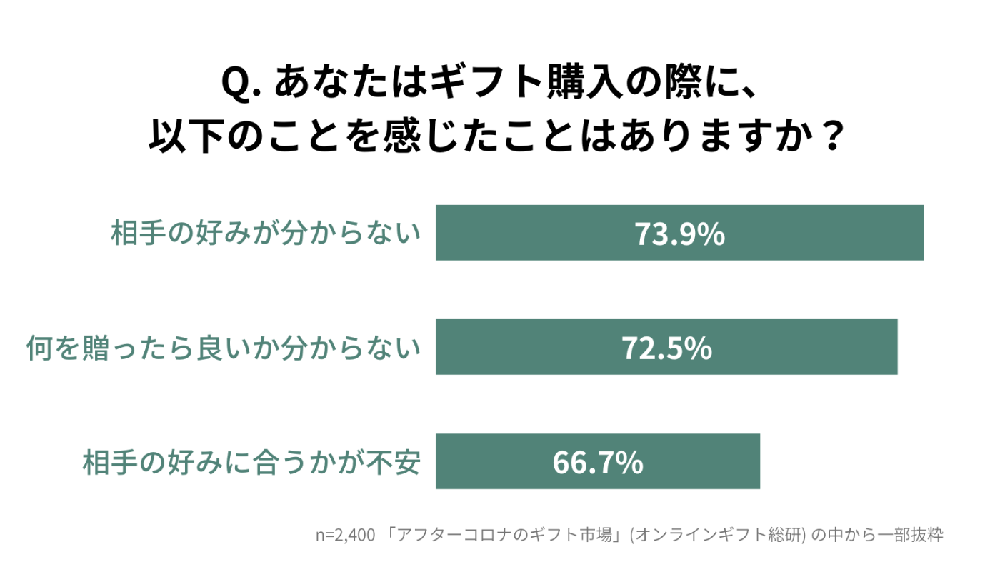
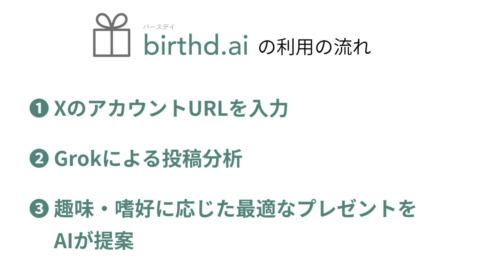
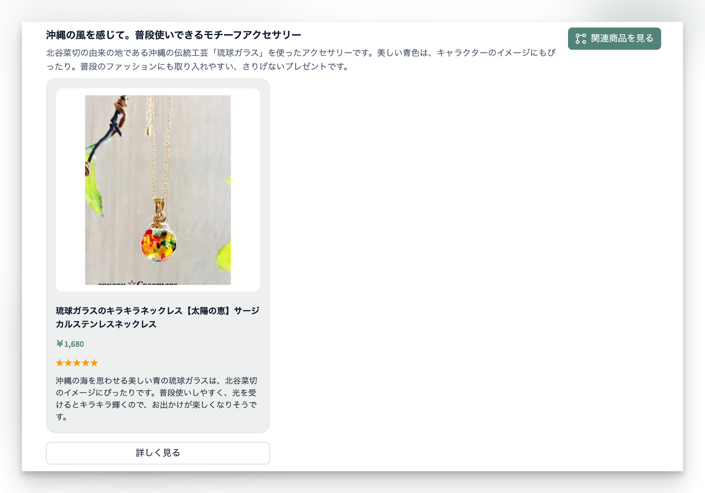
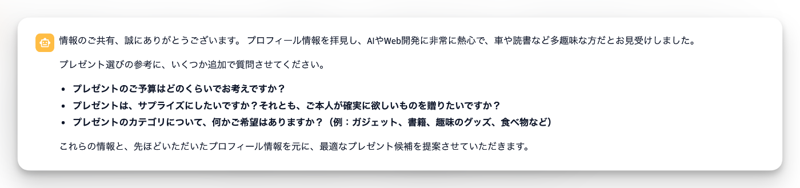
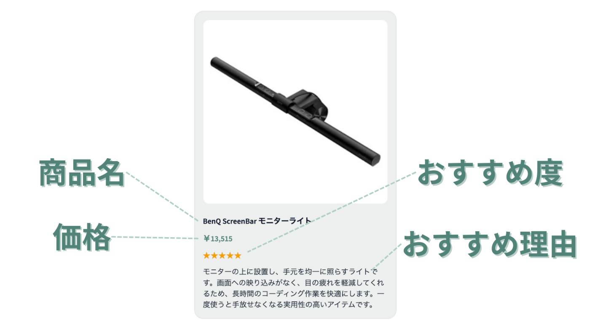
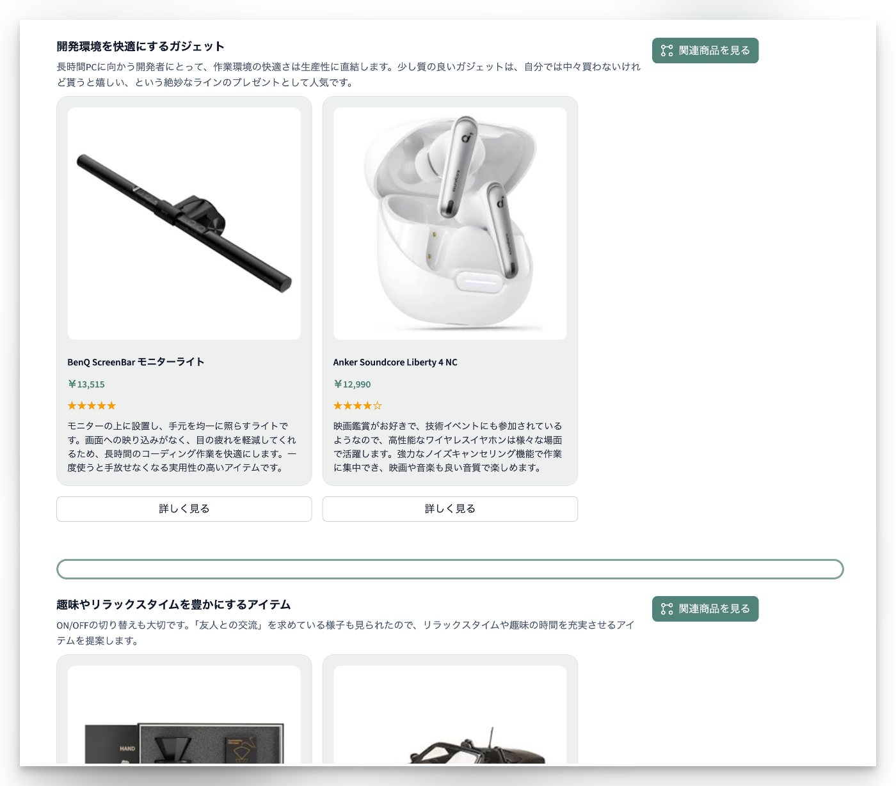
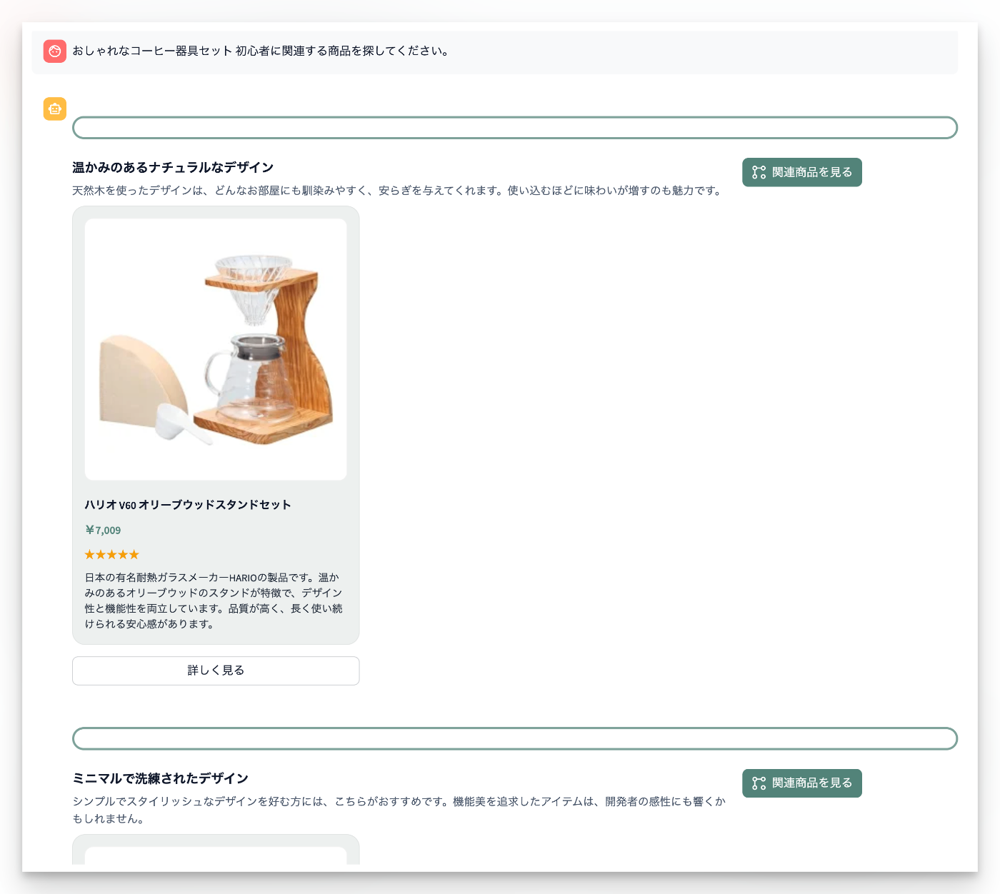
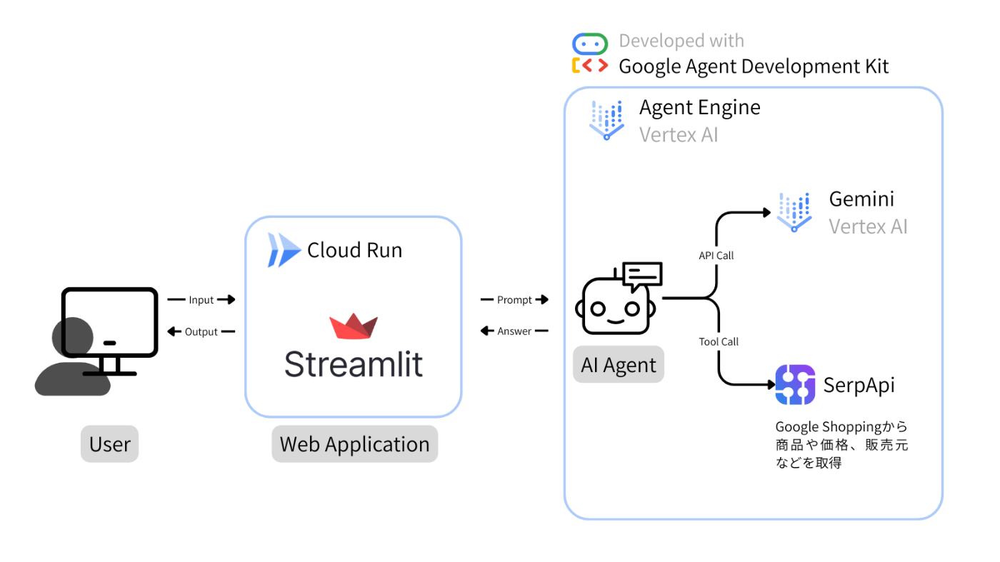

!

本件は[第3回 AI Agent Hackathon with Google Cloud](https://zenn.dev/hackathons/google-cloud-japan-ai-hackathon-vol3) への提出作品です。

##  デモ動画

<https://youtu.be/KkgRFm35a2A>

##  背景：誕生日プレゼントを贈りたいが、相手の好みがわからない

**「あの人の誕生日、何を贈ろう…？」**

毎年やってくる、大切な人やお世話になっている人への誕生日プレゼント選び。相手の喜ぶ顔を想像しながら誕生日プレゼントを選ぶのは楽しいですが、何を贈れば本当に喜んでもらえるか、頭を悩ませることも多いのではないでしょうか。

実際、[オンラインギフト総研の調査](https://www.itmedia.co.jp/business/articles/2305/27/news030.html)によると、プレゼント選びで感じる課題のうち最も多いのが「**相手の好みが分からない** 」（73.9%）だそうです。

何を隠そう、私自身もその一人。毎年頭を悩ませた結果、結局手軽なEギフトで済ませてしまう…。もちろん喜んではくれるのですが、心のどこかで「もっとちゃんと選べたらな」という罪悪感を感じることがありました。

この、プレゼント選びの根源的な悩み、特に「**相手の好みはなんだっけ？** 」という最初の壁を乗り越えるために開発したのが、AIエージェント「**birthd.ai （バースデイ）** 」です。

##  birthd.aiとは？

`birthd.ai`の使い方はシンプルです。**プレゼントを贈りたい相手のX（旧Twitter）アカウントのURLを入力するだけ** 。

すると、AIがあなたとのチャットを通じて、「その人との関係性は？」「予算はどれくらい？」といった質問を投げかけてきます。

そして分析が終わると、Google Shoppingの検索結果と連携し、具体的なプレゼント候補を価格やおすすめする理由と共に、見やすいカード形式で提案してくれます。  

###  コンセプトは「サプライズ」と「視点の発掘」

ここで、次のように思う方もいるかと思います。  
**「Amazonの欲しいものリストを見ればいいじゃないか」「いっそ本人に直接聞くのが一番確実だ」** と。

確かにおっしゃる通りです。しかし、そもそも「おねだりしているようで恥ずかしい」「自分の欲望を公開するのはちょっと…」と、**欲しいものリストを公開すること自体に抵抗がある人** は少なくありません。

また、たとえリストが公開されていたとしても、プレゼント選びの喜びは「効率」や「確実性」だけで測れるでしょうか。

欲しいものリストは、相手が**自覚している** 欲しいものでしかありません。そして、直接聞くという行為は、誕生日プレゼントの醍醐味である「**サプライズ** 」という魔法を、時として解いてしまいます。

birthd.aiが本当に届けたいのは **、「これ欲しかったの、なんでわかったの！？」** という、驚きと喜びに満ちた最高の体験です。Xでの何気ないつぶやきから、本人すら忘れているかもしれない「好き」の種を見つけ出し、最高のサプライズを演出するお手伝いをします。

目指しているのは、単なるプレゼント選びの「自動化」ではなく「**これまでなかった視点での誕生日プレゼントの発掘** 」なのです。

##  検証

###  「刀剣乱舞の北谷菜切が好きな妻へのプレゼントを選んで」と聞いてみたら

提案が的を射たものでないと使い物になりません。そこで、今回は私の妻を例に「刀剣乱舞の北谷菜切が好きな妻の誕生日プレゼントを選んで」と`birthd.ai`に聞いてみました。

結論から言うと **「これ、欲しいと思っていた！」の声を引き出すことができました。**

北谷菜切は沖縄に由来するキャラクター（刀）の1つですが、そのキャラクターに関連するグッズはもちろんのこと、沖縄に関連する普段使いしやすいアイテムまでも推薦してくれましたが、まさにこういったものを欲しいと思っていたらしいです。  
  
刀剣に詳しくない私からすると`北谷菜切`→`沖縄`→`琉球ガラス`という連想は浮かびませんが、AIが新たな視点を与えてくれることでプレゼント選びの幅が広がったことに違いありません。AIならではの「発掘」です。

##  開発の裏側：主な機能とシステム概要

このAIエージェント`birthd.ai`の特徴は以下の通りです。

  * Xのプロフィールを入力すると、投稿を分析して趣味・嗜好や興味のあるものを分析
  * フォローアップ質問でより精度の高い絞り込み 
    * 関係性
    * 性別
    * 予算
  * Google Shoppingを検索し、おすすめ商品を理由とともに表示

###  主な機能

####  Xのプロフィールの分析

ユーザーがXのアカウントURLを入力すると、Grokを使ってユーザーの投稿を分析します。  
なお、この部分は本来エージェントのTool callで実装したいところですが、XのAPIはFreeプランだと投稿のRead数が月100件に絞られてしまうため、下記のURLをユーザーに提示し、クリックするとGrokのWebページにプロンプトが送られるような実装にしています。
    
    
    https://grok.com/?q={profile_url} の投稿やプロフィールを元に、趣味・好きなもの・興味のあるもの・欲しているものなどを推測し、簡潔に回答してください
    

####  フォローアップ質問

予算・関係性・追加の希望などを質問し、より正確にユーザーの意図を理解します。

####  おすすめ商品の表示

カード形式で「商品名」「価格」「おすすめ度」「おすすめ理由」を表示します。  

おすすめ商品はセクションごとに分かれています。  

関連商品の検索もできます。  

##  システム概要

###  アーキテクチャ図

###  技術スタック

領域 | 技術 | 活用方法  
---|---|---  
**AIエージェント開発** | Google Agent Development Kit | エージェント開発フレームワーク・ツール統合  
**AIエージェント実行** | Vertex AI Agent Engine | スケーラブルなエージェントホスティング  
**LLM** | Gemini 2.5 Pro (Vertex AI) | 自然言語理解・推論・日本語対話・プレゼント提案生成  
**フロントエンド・バックエンド** | Streamlit | UI + API連携  
**ホスティング** | Cloud Run | コンテナベースでのデプロイ  
**外部API統合** | SerpApi | Google Shopping検索・商品詳細取得・価格情報収集  
  
##  おわりに：`birthd.ai`が描く、プレゼントの未来

誕生日プレゼントは、選ぶ方ももらう方も難しいものです。「予算は？」「好みじゃなかったらどうしよう…」そんな気遣いが、時として純粋な「お祝いしたい」という気持ちにブレーキをかけてしまいます。

`birthd.ai`は、そんなプレゼントのあり方そのものを、未来では変えられるかもしれないと考えています。

将来的には、 **各個人が持つAIエージェントに、自分の欲しいものリストや最近の興味を預けておく。そして、誕生日が近づくと、私のエージェントとあなたのエージェントが自律的に会話し、予算や好みを完璧に理解した上で、最高のプレゼントを送り合える。** なんてことも実現できると思っています。

`birthd.ai` は1人ひとりの誕生日をより楽しくするAIエージェントです。
