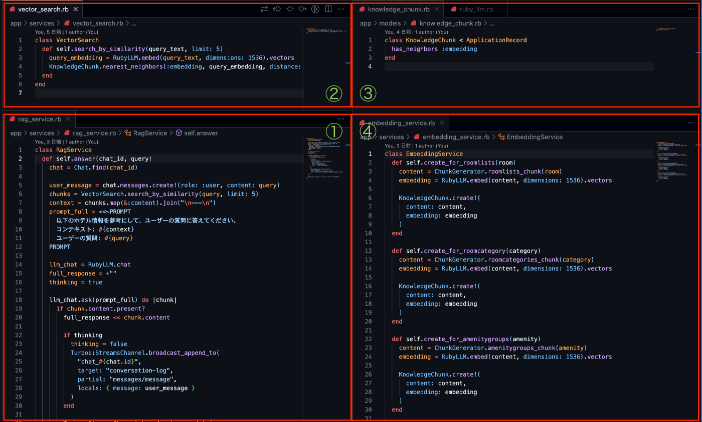
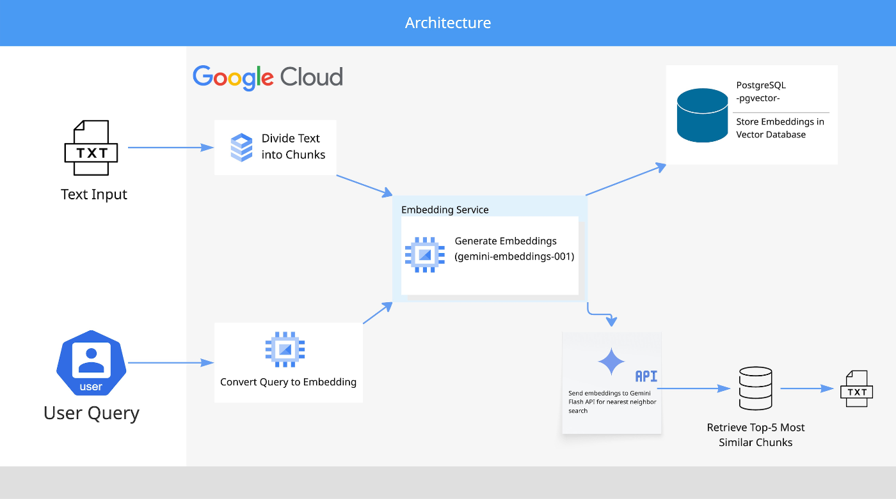

##  1\. はじめに

私たちのチームは、RAG AI搭載の情報検索・整理をチャットやその他インタフェースを通して利用できるアプリを開発しました。  
社内向けのアプリを想定しており、膨大な企業情報をベクトルデータベースとして格納し、トレーニングや普段の業務で気軽に企業情報を検索できるようにするのが狙いです。

##  2\. ターゲットユーザーと課題

企業情報のデータ量は業種によりますが、膨大となるのが一般的です。  
社内PCの共有ファイルに保存されている場合がほとんどだと思いますが、ファイル検索機能や手軽な扱いはメリットですが、複製が容易なため似たような名前のファイルが乱立することも事実です。

私たちが働いているホテルでは、共有ファイルとスプレッドシートに情報を格納しており、カテゴリーはシート毎で管理しています。  
シートの名前からカテゴリーを見分け、その中から欲しい情報を探すわけですが、保存方法にルールはなく書き方や保存方法も様々です。  
使い方に慣れるとどの情報がどこにあるのか、おおよその見当はつきますが、新入社員にとってはハードルとなるでしょう。

そうした課題を解決するべく、Knowledge Hubの開発の構想を立て、今後はこのアプリを企業内でのトレーニングに活用することもでき、統一された管理のもとで情報を保管できるようになります。  
また想定されるメリットとしては、以下の通りです。

  * 情報検索に5分ほど時間を要していたのが1分ほどに短縮される。
  * 新入社員の教育時間が短縮される。
  * 属人化した業務知識の標準化につながる。

「Knowledge Hub」は、気軽に情報を取得でき、情報の重複を排除し、常に最新の情報にアクセスできる利点を活かしたアプリです。

##  3\. 課題へのソリューションと特徴

前項で述べた課題を解決するべく実装したKnowledge Hubの機能は、主に3つです。

  1. 従業員アカウント作成の機能 (管理者(admin)だけが操作できる機能)
  2. 企業情報の新規登録・更新・削除機能 (従業員(employee)が操作できる機能)
  3. RAG AIを搭載したチャットアプリ機能 (従業員(employee)が操作できる機能)

開発にあたりホテル情報を保存するテーブルは、以下の4つのみですが、ホテルの規模・要件によっては増えることも想定しております。

  1. ホテルの客室情報
  2. アメニティーの情報
  3. 客室カテゴリーの情報
  4. 施設情報

###  3.1 NotebookLMとの違い

Notebook LMはPDFやソースとなるサイトURLを添付することで、情報の取得ができますが、  
Knowledge Hubはユーザーが情報を登録する必要があります。  
また、ログイン機能を持たせていることで社外に情報が漏れることなくアプリを使える特徴があります。

##  4\. 技術スタック詳細

  * ユーザー認証: Ruby gem "Devise"
  * バックエンド: Ruby on Rails (Rails 8.0.2.1)、Turbo-frame、Turbo-streams
  * API AI model: gemini-2.5-flash-lite
  * Embedding model: gemini-embedding-001
  * デプロイ: Cloud Run
  * データベース: PostgreSQL
  * ベクトルデータベース: pgvector

###  4.1 API call

Knowledge Hubでは、Ruby on Railsのgem「RubyLLM」を活用し、AI機能を提供するAPIエンドポイントを構築しています。(以下、公式ドキュメント)

<https://rubyllm.com/>

公式ドキュメントではモデルクラスファイルに、検索用メソッドを"scope"と、エンベディングメソッドも定義していました。

↓以下、公式ドキュメント。
    
    
    # app/models/document.rb
    class Document < ApplicationRecord
      has_neighbors :embedding
      before_save :generate_embedding, if: :content_changed?
      scope :search_by_similarity, ->(query_text, limit: 5) {
        query_embedding = RubyLLM.embed(query_text).vectors
        nearest_neighbors(:embedding, query_embedding, distance: :cosine).limit(limit)
      }
    
      private
      def generate_embedding
        return if content.blank?
        puts "Generating embedding for Document #{id}..."
        begin
          embedding_result = RubyLLM.embed(content)
          self.embedding = embedding_result.vectors
        rescue RubyLLM::Error => e
          errors.add(:base, "Failed to generate embedding: #{e.message}")
          throw :abort
        end
      end
    end
    

以下、Knowledge Hubのソースコード。  
チャットモデルとエンベディングの分離を行いたかったので、リソースのエンべディング・検索クエリのエンベディング・RAG検索の機能のロジックを別々のファイルで作成することで責務の分離・保守のしやすさを重視いたしました。

  1. ①RAG Serviceのクラスメソッドでユーザからの質問をqueryに保存。
  2. queryを②Vector Searchメソッド渡します。

  * gemのヘルパーメソッド RubyLLM.embedに渡すことで、エンべディング化してくれます。
  * エンべディングをKnowledgeChunkモデルに渡すことで、データ保存されているエンべディングとの類似検索をしてくれます。
  * Knowledge HubのRAG検索では、コサイン類似度を採用しています。  
これはデータ保存されたベクトルと、ユーザ質問のベクトルを一つの図で表すことができ、  
それらが近いか、遠いかで返される回答の粒度が決まるというものです。  
コサイン類似度の単位として、dimensionsがありこれは任意に設定します。  
dimensionsの値が大きいほど精度が上がりますが、処理に要す時間が増えます。  
逆に小さいほど処理は早いですが、前者と比べて精度が落ちるというものです。

  3. 類似度検索の結果を①のprompt_full変数に代入し、askメソッドでAIに投げます。
  4. AIが返す回答を順次ストリーミングでチャットボックスの下に表示さえるよう設定しています。
  5. ④では新しい情報を登録する際や、更新時に新たにチャンク化をするためのメソッドです。  
Railsのcreateメソッドが呼び出された時に実行されるよう実装しています。

##  5\. システムアーキテクチャ

###  5.1 RAG検索のシステムフロー

RAG AIに情報を学習させる手段としてはPDFやWordといったファイルのアップロードが簡単ですが、  
Knowledge Hubでは登録用のインタフェースを実装し、新規登録・更新・削除ができるようにいたしました。

##  6\. デモ動画(情報登録画面)

チャットを使う前に、まずは情報の登録を行う必要があります。  
今回はホテルで働いていることを想定し、客室情報やレストラン・ショップといった館内施設情報をそれぞれテーブルを作成し、登録を行なっていきます。

<https://www.youtube.com/watch?v=9yQ3PAZ9qco>

##  7\. デモ動画(RAGベース検索画面)

小規模のホテルから大規模ホテルまで、情報量関係なく登録できそれらをRAG AIで検索することが可能になります。

<https://www.youtube.com/watch?v=WWc-8GekB_g>

##  8\. 今後の展望

  * Embedding化処理の最適化  
現在は create メソッドで Embedding 化フローを呼び出していますが、将来的には before_save コールバックに処理を移行し、保守性・再利用性を高めた設計に改善します。

  * UI/UXデザインの向上  
今回はデザイン性を優先しませんでしたが、今後はユーザーが使いやすく、見た目にも美しいインターフェースを設計していきます。

  * ベクトルデータベース管理機能の充実  
現時点ではベクトルデータベースに保存されているデータの更新・削除機能が未実装のため、公式ドキュメントを参考にしつつ、これらのメソッドを実装していきます。

##  9\. ハッカソンを終えて

今回初めてAIを使ったアプリケーションを開発しました。  
Ruby on RailsからAPIを叩く手法は、これに関する記事が少なく公式ドキュメントを読んでも実装できるのに時間を要しました。

APIとしてのAI実装と、APIそのものの理解が薄く感じたので改めて学習し直すきっかけとなりました。  
また、チャットアプリの機能としてHotwire技術も導入いたしました。

教材や公式ドキュメントを参考にしましたが、上手く動かない事もありました。  
DOM要素の理解や、Hotwire全体の知識理解を改めて深堀りしていこうと感じました。
