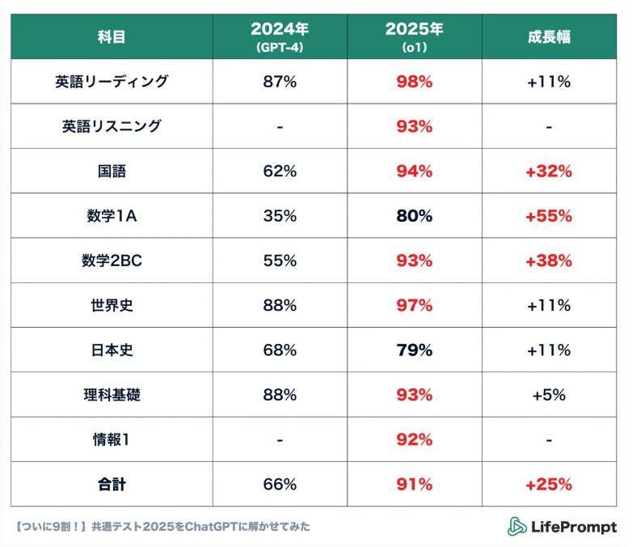
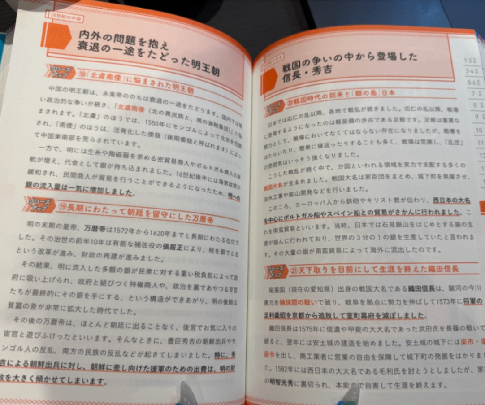
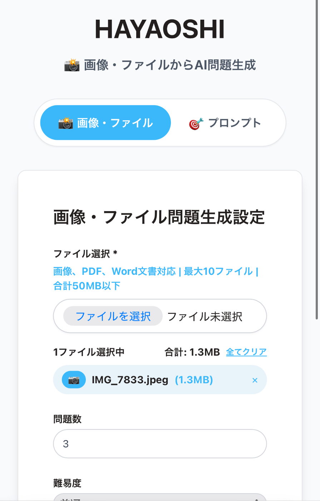
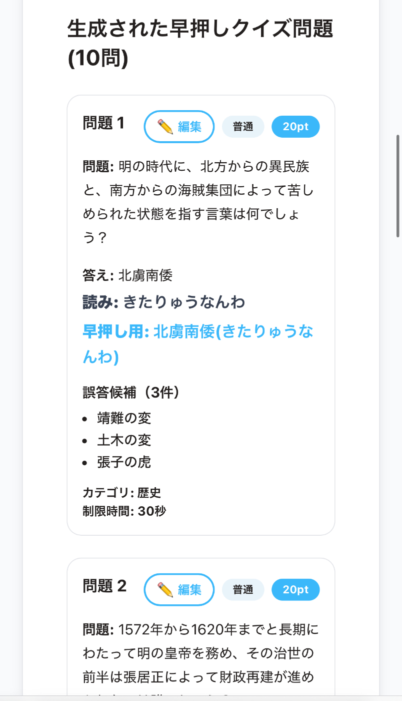
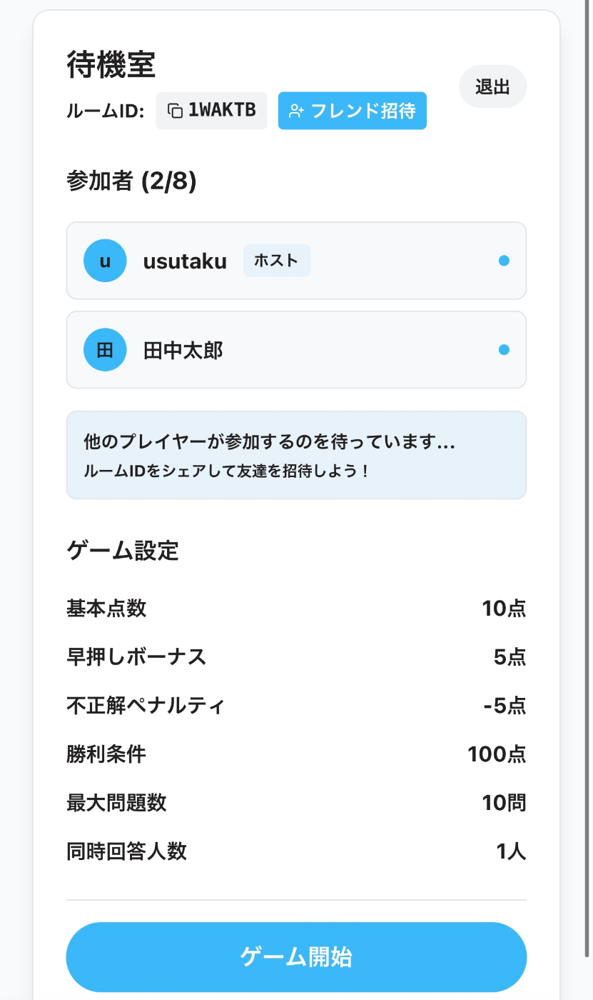
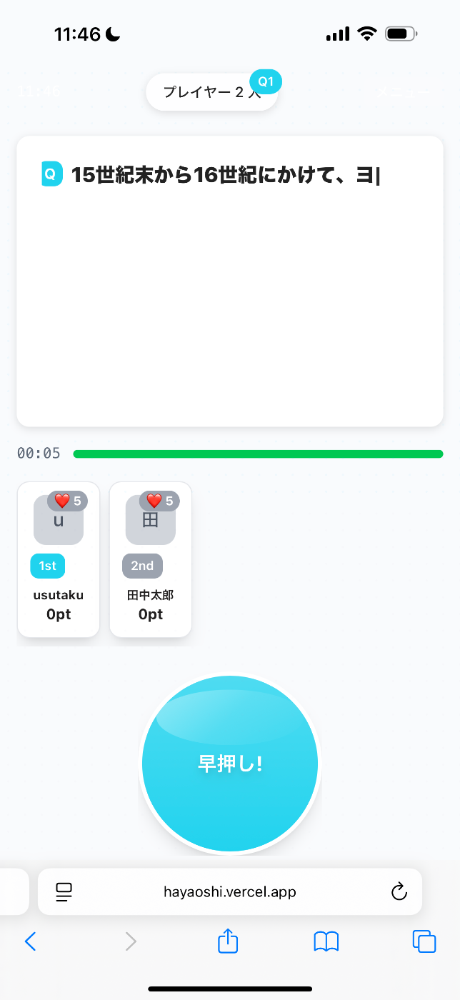
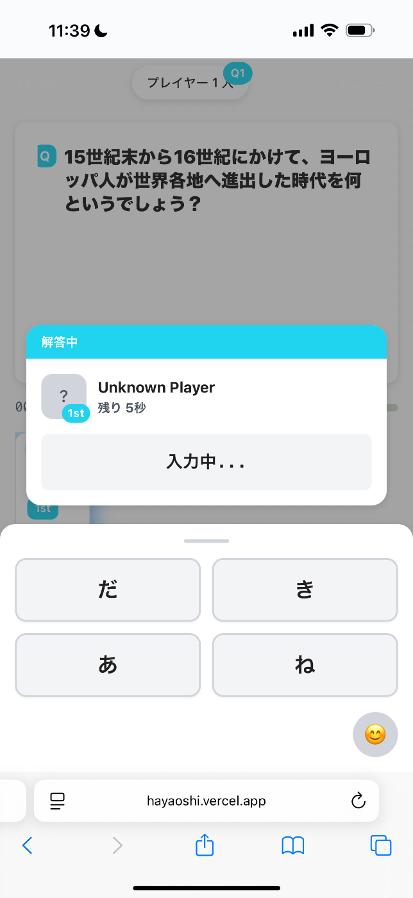
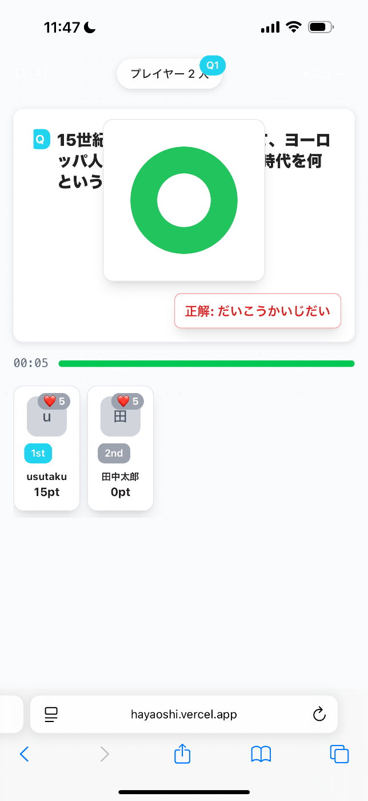
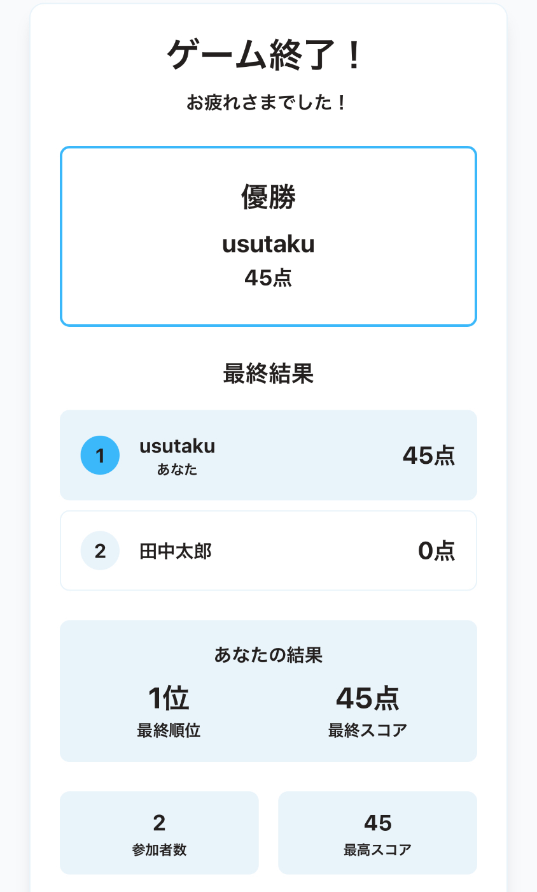
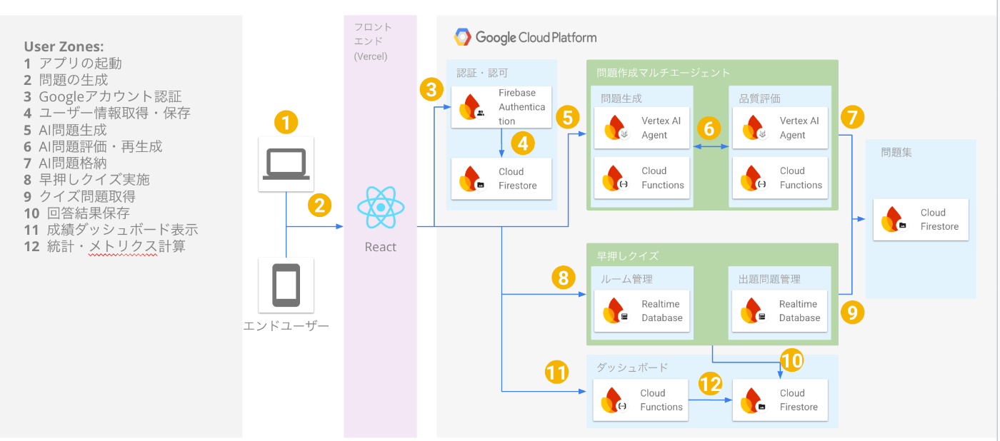

#  紹介動画

<https://youtu.be/IkPOVG1wqo4>

#  はじめに

本記事は、第3回AI Agent Hackathon with Google Cloud応募作品である、対戦ゲーム型学習アプリ「HAYAOSHI」の解説記事です。

##  背景・課題

「AI時代に暗記の必要性ってあるんですか？」  
近頃、何度も学生から聞かれる質問です。

現在私は大学の特任准教授として日々学生に指導をする他、AIの使い方を多くの人に対して教えるAI研修の会社の代表を営んでいます。

その中で、中学・高校・大学生から、従来の詰め込み型の学習に対する疑問をたくさんぶつけられます。  
なるほど、私が学生の頃は暗記に対して何も感じませんでしたが、今の学生が不満に思うも無理はありません。何故なら、暗記によって答える知識問題は全てAIでも回答可能だからです。  
  
例えば、2024年時点で66%の正答率であったChatGPTによる共通テストの回答は、2025年で91％となりました（筆者が共同創業した会社：LifePromptによる調査）。

AIが9割以上解いてしまう問題を、何故わざわざ人間が解かないといけないのか。  
そう思い勉強に対するモチベーションが下がるのは、何も不自然ではありません。

しかしながら、様々な意見がある一方で暗記は依然として重要です。  
共通試験のあり方が今年から急に変わることもないですし、暗記は思考力にも明確に結びついています。  
多くの論文がこの関係性を示していますが、例えばウィリンガムの研究によれば、「Inflexible Knowledge（いわゆる基礎的事実知識）」は後の柔軟な問題解決の前提となる」（Willingham, 2002）と述べる他、「高次思考を育てるには、各教科ごとに固有の知識・技能を積み上げる必要がある」（Willingham, 2020）とも伝えています。

他にも長期記憶、ということに関して言えばまずは自分が「Pretesting(自力想起)」をした上で、その後にAI活用をする方が、最初からAIに依存した群よりも長期保持が高いということを示す実験もあります（Bai, Liu, & Su, 2023）。

というわけで、今回は解くべき課題として「暗記が苦手な中学生・高校生が、AI時代にモチベーションを保ったまま勉強をする方法の模索」を設定しました。

##  解決策

この課題を解くために「学生時代の自分が使いたくなる学習方法」を探ることにしました。

振り返ってみると、高校生の頃の自分は怠惰な性格でした。  
勉強中長時間の集中ができず、すぐに友人達とスマホゲームをしてしまっていました。  
一方でゲームへの熱中は凄まじく、色々作戦会議をしてどうやったら勝てるかを研究しました。  
誰かと一緒にゲームをするのは楽しかったのです。その熱が少しでも勉強に向いていたら...と多少後悔することもありました。

そこで思いついたのが「友人とゲームをする形式で勉強ができたら楽しい」ということでした。  
生まれたのが、早押しクイズアプリの「HAYAOSHI」

1.ユーザーは暗記したい科目の問題集・教科書を手元に用意  
2.HAYAOSHIで写真を撮影  
3.HAYAOSHI AI Agentが問題を自動生成  
4.クイズルームを作成し友人を招待  
5.HAYAOSHIクイズを友人と複数人でプレイ  
6.結果発表  
というユーザー体験です。

##  プレイ画面

1.ユーザーは暗記したい科目の問題集・教科書を手元に用意  
  
2.HAYAOSHIで写真を撮影・アップロード  
  
3.HAYAOSHI AI Agentが問題を自動生成  
  
4.クイズルームを作成し友人を招待  
  
5.HAYAOSHIクイズを友人と複数人でプレイ  
  
  
  
6.結果発表  

##  利用した技術スタック

###  システムアーキテクチャ

###  フロントエンド

技術 | 用途 | 特徴  
---|---|---  
**React** | UI構築 | 最新のConcurrent Featuresを活用したモダンなUI構築  
**TypeScript** | 型安全性 | 開発効率とバグ防止の向上  
**Vite** | ビルドツール | 高速ビルドシステムによる開発効率の向上  
**Tailwind CSS** | スタイリング | ユーティリティファーストCSSによる保守性の高いスタイリング  
**Framer Motion** | アニメーション | 滑らかなアニメーション効果  
**Zustand** | 状態管理 | 軽量な状態管理ライブラリ  
**React Router** | ルーティング | SPA用ルーティング管理  
  
###  バックエンド・AI

技術 | 用途 | 特徴  
---|---|---  
**Firebase Functions** | サーバーレス実行 | サーバーレス実行環境  
**Cloud Functions** | サーバーレス実行 | Firebase Functionsの基盤となるGoogle Cloud Functions  
**Vertex AI Gemini** | AI処理 | Google最新のマルチモーダル大規模言語モデル  
**Firebase Realtime Database** | リアルタイム同期 | 早押しゲーム実現のためのミリ秒レベルの同期  
**Firestore** | データベース | NoSQLドキュメントデータベース  
**Express.js** | API フレームワーク | RESTful API フレームワーク  
**Firebase Admin SDK** | サーバー管理 | Firebase管理機能  
  
##  二つのエージェントを採用した理由

###  1\. Agent2Agentプロトコルの採用理由

学習効率に直結する問題の質を高めるため、AI問題生成ロジックにはマルチエージェントを採用しました。

####  問題生成エージェント（A2AQuestionGeneratorAgent）

  * **役割** : 画像解析による問題生成
  * **特徴** : 創造性と教育的価値を重視
  * **技術** : Vertex AI Gemini 2.0 Flashを活用したマルチモーダル分析

####  品質評価エージェント（A2AQualityReviewerAgent）

  * **役割** : 生成された問題の品質評価と改善提案
  * **特徴** : 客観的な評価基準による品質保証
  * **技術** : 構造化された評価プロンプトによる一貫した品質管理

###  2\. 協調システムの利点
    
    
    // A2A協調フローの実装例
    export class A2AMultiAgentOrchestrator {
      async executeA2AWorkflow(request: AgentRequest): Promise<AgentResponse> {
        // 1. 問題生成エージェントが問題を作成
        const generationResult = await this.sendFirebaseA2AQuestionGenerationRequest(
          conversationId, enhancedRequest, previousReview
        );
        
        // 2. 品質評価エージェントが品質をチェック
        const reviewResult = await this.sendFirebaseA2AQualityReviewRequest(
          conversationId, currentQuestions, requirements
        );
        
        // 3. 品質基準に基づいて次のアクションを決定
        if (nextAction.action === 'send_a2a_message' && nextAction.function === 'delivery-agent') {
          // 品質OK → 配信
        } else {
          // 改善必要 → 再生成ループ
        }
      }
    }
    

####  採用理由の詳細

  1. **品質保証の自動化** : 単一AIでは主観的になりがちな品質評価を、専門エージェントが客観的に実施
  2. **反復改善** : 最大4回の改善サイクルにより、継続的な品質向上を実現

##  早押しクイズ実現のためのリアルタイムデータベースの使用

###  Firebase Realtime Databaseの採用理由

早押しクイズの特性上、同期が要求されるため、Firebase Realtime Databaseを採用しました。

####  技術実装
    
    
    // リアルタイム同期の実装例
    import { ref, onValue, off } from 'firebase/database'
    
    // ゲーム状態のリアルタイム監視
    const gameStateRef = ref(rtdb, `rooms/${roomId}/gameState`)
    onValue(gameStateRef, (snapshot) => {
      const gameState = snapshot.val()
      // ゲーム状態の変更を即座に反映
      updateGameState(gameState)
    })
    
    // プレイヤーの回答状況をリアルタイム同期
    const updateLiveAnswerProgress = (roomId: string, playerId: string, progress: any) => {
      const progressRef = ref(rtdb, `rooms/${roomId}/liveAnswerProgress/${playerId}`)
      set(progressRef, {
        ...progress,
        timestamp: serverTimestamp()
      })
    }
    

####  早押しクイズ特有の要件への対応

  1. **同時押し検出** : 複数プレイヤーが同時にボタンを押した場合の処理
  2. **回答権の管理** : 最初に押したプレイヤーへの回答権付与
  3. **ゲーム状態の同期** : 問題表示、回答受付、結果表示の状態管理
  4. **スコアの即座更新** : 正解/不正解によるスコア変動のリアルタイム反映

###  データフロー

* * *

##  終わりに

AIの進化が凄まじい現状学校教育のあり方は柔軟に変わっていくべき、というのは少しでもAIを触ったことがある人であれば当然のように感じる課題なはずです。  
しかしながら、今年からすぐに共通試験がAI利用可能になったり、選択問題が完全に無くなり記述だけになることは不可能です。

であればせめて、学習方法だけでもAIを使って効率的にそして楽しくできることを教育者は目指すべきでしょう。「HAYAOSHI」を使って放課後にリーダーが問題を作って、皆がそれを使って楽しく遊ぶ未来はとっても素敵だと思います。

##  参考文献

Bai, X., Liu, Y., & Su, H. (2023). Pretesting with conversational AI improves later retention compared with immediate AI assistance. Frontiers in Psychology, 14  
Willingham, D. T. (2002). Ask the cognitive scientist: Inflexible knowledge: The first step to expertise. American Educator, 26(4), 31–33  
Willingham, D. T. (2020). Ask the cognitive scientist: How can educators teach critical thinking? American Educator, 44(3), 41–45, 51.

* * *

チーム名：こんぱす  
チームメンバー：井上拓海、臼井拓水、木村北斗、  
プロダクト名：HAYAOSHI
