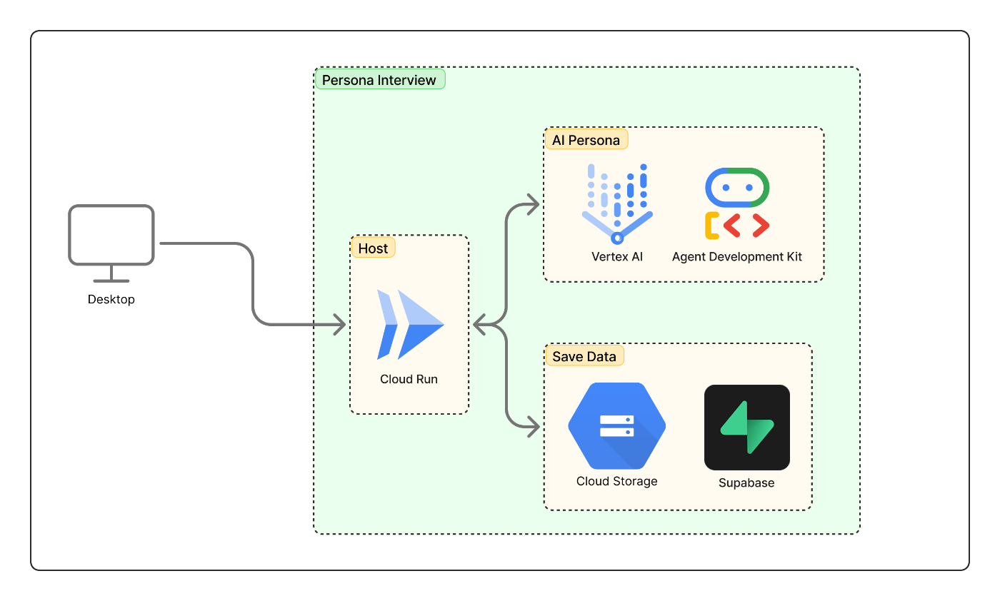

#  1.【背景】1億人のAIペルソナにユーザーインタビューしたい

ChatGPTやClaudeなどに企画の壁打ちをしていました。その時には「**の専門家として回答して」という役を与えていたのですが、ふと「**の専門家として」という部分をもっと現実に即して本物の人間のようになったら面白いのでは？と思ったのがきっかけです。

さらに、LLMで与える役自身も、仮想的な環境で実世界のように生活していたら、よりリアルなインタビュー結果をもらえるのかなと思いました。

突拍子もないですが、仮想世界(LLM)でAIペルソナを日本のように生活させて、1億人(日本の人口)のAIペルソナからランダムに抽出してユーザーインタビューをし、その結果を私たちのサービスに還元してみたら、面白いもの作ってみたい！というのもモチベーションの一つです。仮想日本世界で評価高いサービスは、現実でも評価が高いのだろうか、、  
とはいえ1億人のAIペルソナを用意するのは難しいので、まずは少数のAIペルソナを呼び出してインタビューできる仕組みを作りました。

#  2.【課題と解決策】

ユーザーインタビューで以下のような課題を感じています。

  * ユーザーインタビューをオフラインで行う際に発生する工数が大きい。オンラインでAI相手に実施できると格段に削減できる。
  * AIへのインタビューだと画一的な、ただそれっぽい結果になってしまう。

上記課題を解決するため、オンライン上でリアルなユーザーインタビューができる仕組みを作りました。  
画一的な結果にならないよう、以下の2点の工夫をしています。

###  1.リアルなAIペルソナを作る

よくあるペルソナは、以下のような簡単なものが多いです。
    
    
    田中美咲（32歳、会社員）
    職業：IT企業でプロジェクトマネージャー
    年収：600万円
    居住地：東京都世田谷区
    家族構成：夫、3歳の娘
    趣味：ヨガ、カフェ巡り、読書
    悩み：仕事と育児の両立、時短料理のレパートリー不足
    情報収集：Instagram、YouTube、ママ友からの口コミ
    購買行動：品質重視、レビューを必ずチェック
    

一方で今回のAIペルソナではより現実的なペルソナにするために具体的な設定を多く盛り込みました。  
例えば、【黒歴史】。人は誰でも隠したくなるような過去を持っているので、これをペルソナに与えてより背景を持たせました。他にも【過去】や【ストーリー】などを足してペルソナに厚みを持たせています。  
以下は実際に作成したAIペルソナの一つです。従来のペルソナに比べ、ストーリー性や黒歴史なども含めています。
    
    
    藤本 明子
    【基本属性】
    - 年齢: 33歳
    - 性別: 女性
    - 職業: IT企業の人事・採用担当（中途・新卒採用、オンボーディング、制度設計を兼務）
    - 居住地: 東京都新宿区の1LDK賃貸マンション
    - 年収: 約520万円
    - 家族構成: 独身、一人暮らし
    
    【心理的要素（サイコグラフィック）】
    - 価値観: 公平性・誠実さ・キャリア支援・チーム文化の醸成
    - 性格: 社交的で聞き上手だが、細かいところまで気にして疲れやすい
    - ライフスタイル: 平日は採用業務で多忙。休日は友人と食事や美術館めぐりでリフレッシュ
    - 趣味: ヨガ・ワイン・読書（キャリア系やエッセイ）、旅行
    - 動機/ニーズ: 会社と候補者の「ベストマッチ」を実現し、長期的に活躍できる人材を採用したい
    
    【行動特性】
    - 購買行動: サブスク型サービス（英会話・ヨガ）を好む。利便性や時間短縮になるものを優先
    - 情報収集源: LinkedIn、Wantedly、HR系メディア、Twitter/X
    - ブランド態度: 「人や組織に良い影響を与えるブランド」を好む
    - 投稿習慣: 採用広報記事をnoteで執筆、LinkedInで会社の魅力発信も担当
    
    【状況・コンテキスト】
    - 生活ステージ: 独身・30代前半、キャリアアップや専門性強化を模索
    - 利用シーン: 面接アレンジ、候補者対応、採用イベント企画、評価制度設計
    - 制約条件: 採用目標と現実のミスマッチ。採用コストや人員不足のプレッシャーが大きい
    - デバイス/チャネル: MacBook、iPhone、Slack、Zoom、Google Workspace、LinkedIn
    
    【物語性（ストーリー）】
    - 一日の過ごし方: 朝は応募者のメール対応→午前は面接調整→午後は採用広報や社員面談→夕方は経営層へのレポート作成。夜はヨガや友人と食事でストレス発散
    - 抱える課題: 「数を追う採用」と「質を重視する採用」の板挟み。経営層からは短期成果を求められる一方で、現場からはカルチャーフィットを重視される
    - 理想像/期待: 「社員が安心してキャリアを築ける環境」を作ることで、採用した人が長期的に活躍する姿を見ることが目標
    
    【過去（バックグラウンド）】
    - 学生時代: 文学部出身。就活で苦労した経験から「キャリア支援」に関心を持つ
    - 人生の転機: 新卒で営業職に配属→自分に合わず退職→人材会社に転職→人事キャリアへ
    - 購買体験: 自己啓発セミナーで高額な講座を受講し「費用対効果」を痛感。以降はROIを常に意識
    - 文化的背景: 学生時代に留学経験があり、多様性やグローバル感覚を重視
    
    【黒歴史】
    - 就活時代、志望動機を丸暗記して面接で空回り→その経験が「自然体で候補者を見る」姿勢につながっている
    - 新卒で営業に配属された際、成果が出ずに毎日泣いていた。今でも思い出すと赤面
    - 採用イベントで「社内の雰囲気を明るく見せよう」と空回りして、参加者から「圧が強い」とアンケートに書かれた
    

また、今回は専門家6人（デザイナー・PM・シニアエンジニア・マーケター・法人営業・人事/採用担当）と一般の方4人（主婦・退職者・大学生・高校生）のペルソナを用意して会話できるようにしました。様々な背景・観点から意見を貰えるようにしています。

###  2.AI同士で対話させて、回答を得る

AI単体への質問だとどうしても画一的な感じが残ってしまうので、グループ形式でインタビューする仕組みを設けました。  
これにより、グループ内で会話しながら回答を作るので単純な回答ではなくより複雑な結果になります。場合によってはAI同士で話して脱線するようなこともあり、人間っぽさを感じることができます。  
途中の会話を見ることもできるので、実際の人間にインタビューするような臨場感を感じられます。

#  3.【サービス詳細】

###  概要

本サービスでは、リアルなユーザーに即したAIペルソナ10人を用意しており、自由にインタビューをすることができます。問いかけで終わるのではなく、実際にチャット上で会話をすることが可能です。  
AIペルソナへのインタビュー方法は3パターンあります。

###  ①一斉インタビュー

10人のAIペルソナに対して、入力した質問に対して全員が回答してくれます。最後に回答もまとめられるので、サクッと見たいときは最後だけ確認することも可能です。

###  ②グループインタビュー

3~4人のAIペルソナグループに対して質問ができます。この時、質問に対してグループ内で会話してから回答が行われます。AIペルソナ同士での会話も確認することができます。

###  ③個別インタビュー

AIペルソナ単独に対してインタビューすることもできます。ここでは、純粋にAIペルソナ一人に対してインタビュー・会話を続けることができます。

#  4.デモ動画

<https://youtu.be/Pv2CsfhL7o0>

#  5.システムアーキテクチャ

本サービスは、Agent Development Kitを活用してAIエージェントと会話するWebアプリケーションです。以下にシステム構成図を記載します。  

##  選定理由

Agent Development Kitを当初はCloud Runにホスティングしていたのですが、Session管理を自前でする必要があったためVertex AIにデプロイしました。Vertex AIにデプロイすることでSession管理だけでなく、会話用のストリーミングエンドポイントが自動作成されるなど、開発効率が格段に上がりました。

#  6.最後に

1億人にユーザーインタビューすることはできませんでしたが、最小機能としてリアルなAIペルソナにインタビューする仕組みを作ることができました。  
今回はグループでのインタビューや一斉インタビューの仕組みで工夫しましたが、今後は音声入力や画像入力・さらにはPlaywrightを使ってwebサービスを触りにいくなど、インプットの仕方を増やしてより現実的なユーザーインタビューに近づけていきたいと思っています！  
<https://persona-si5ddtftzq-an.a.run.app/>  
最後まで読んで頂きありがとうございました！
