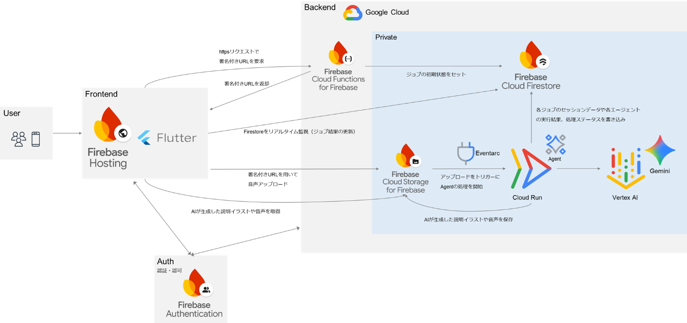
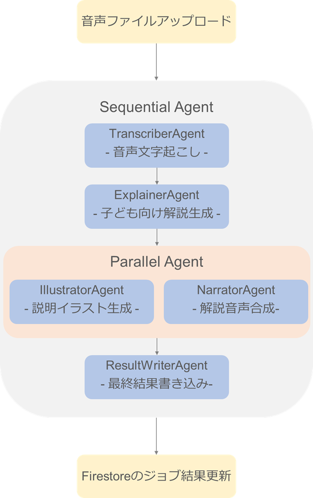

この記事は第3回 AI Agent Hackathon with Google Cloud に提出する作品です。  
<https://zenn.dev/hackathons/google-cloud-japan-ai-hackathon-vol3>

##  はじめに

はじめまして！簡単に自己紹介と、ハッカソンに参加するきっかけについて述べます。  
私は社会人4年目で、普段は都内でソフトウェアエンジニアとして働いています。今年の4月から新しい会社に転職し、現在は2社目です。  
業務ではAWSで開発を行っているのですが、Google CloudのCloud Runでのアプリ開発に興味を持ち、プライベートで有休を取得して今年の8月にGoogle Cloud Next Tokyo 2025に参加しました。そこでこのハッカソンの存在を知り、前からAIエージェント開発に挑戦してみたかったこともあっていい機会だと考えて参加することにしました。  
後ほど採用技術についても触れますが、ほとんど初めて触る技術ばかりだったので、開発の際はGemini, Gemini Code Assist, ChatGPTをフル活用しています。まさに今の時代ならではのハッカソン体験だったと感じています。

##  Coco-Aiが提供する体験

###  対象ユーザー像と課題

このアプリが対象とするのは、好奇心がどんどん増していく未就学児の子どもと、子どもの健やかな成長を願うすべてのパパ・ママです。

子どもの尽きない「なんで？」に、できることなら丁寧に向き合いたいとパパ・ママは思っています。しかし、必ずしもそうできないタイミングもあります。  
夕食の準備で手が離せないとき。静かにしていてほしい電車の中。少しだけ自分の時間が必要なとき。スマートフォンは、現代の育児において、なくてはならない頼れるパートナーでもあります。

では、そのスマホで過ごす時間に、パパ・ママは何を願うでしょうか。きっと、ただ時間をつぶすのではなく、子どもの知的好奇心を豊かに育むチャンスがあってほしいと願っているはずです。

しかし、それは教育コンテンツなどの動画を見せることだけで得られるのでしょうか？  
私は、新しい知識などに親子で一緒に驚き、それをきっかけに言葉を交わす「親子の会話」も必要だと考えています。

現状、子どもの興味を引くのは受動的に楽しむ動画コンテンツが中心です。その場合、忙しくて別のことをしている親が輪の外に置かれがちになってしまうと思います。子どもが画面に夢中になるほど、それを親子で分かち合う「会話」の機会は失われ、親子の間に見えない壁ができてしまうのではないでしょうか。

この、「画面の向こう側のコンテンツに育児を任せる」という手軽さと、「目の前にいる我が子と対話しながら学びたい」という愛情との間で生まれる、小さな葛藤。この課題を解決したいと考えました。

###  課題に対するソリューション

上記の課題を解決するのが **Coco-Ai (ココアイ)** です。Coco-Aiは、単にAIが質問に答えるだけのアプリではありません。私たちのゴールは、AIを触媒として親子のコミュニケーションを誘発し、受動的なスクリーンタイムを、能動的で質の高い「学び」と「親子の会話」へと変えることです。

具体的な利用フローを、クジラの質問を例に説明します。

  1. 子どもの「なんで？」を「ココ」が受け取ります  
子どもが「クジラさんはなんで大きいの？」とCoco-Aiに話しかけると、可愛いキャラクターの「ココ」がその声を受け取り、物知り博士の「アイ」に問いかけます。

  2. AIからの解説とイラストを表示  
物知り博士の「アイ」が、子どもにも分かりやすい言葉で「クジラはね、海の中では敵がいないから、安心してどんどん大きくなれるんだよ」と解説します。同時に、AIが生成した迫力満点のクジラのイラストが表示され、子どもの視覚的な理解を助けます。

  3. 会話を促す「おはなしのタネ」  
そして、ここがCoco-Aiの最も大切な機能です。AIの解説に加えて、親子の会話を促すヒントをアプリ上に表示します。

「クジラさんの夢って、どんなだろうね？と聞いてみましょう！」

このヒント「おはなしのタネ」があることで、親は子どもの想像力を膨らませる次の問いを自然に投げかけることができます。これにより、親子の視線はスマホの画面からお互いの顔へと移り、AIから始まった学びを、親子間の会話へとつなげることができます。

###  デモ動画

<https://youtu.be/yAdrZJJPmsU>

##  アーキテクチャ・採用技術

###  システムアーキテクチャ

  * フロントエンド：Firestoreと連携するリアルタイムUI 
    * UIは`Flutter`で構築。
    * Webアプリとしてビルド、`Firebase Hosting`にデプロイ。
    * `Firestore`を監視し、ジョブ結果が更新されるとリアルタイムでユーザーに結果を表示。
  * バックエンド：イベント駆動型のサーバレス非同期処理 
    * フロントエンドからはHTTPSで`Cloud Functions for Firebase`にリクエスト。
    * Cloud Functions for Firebaseが署名付きURLを発行して返却。それを利用して`Cloud Storage for Firebase`に音声ファイルをセキュアにアップロード。
    * AIエージェントは`Cloud Run`にデプロイ。Cloud Storage for Firebaseに音声ファイルをアップロードすると、それを`Eventarc`が検知し、AIエージェントのメイン処理を非同期で開始。
    * エージェントの処理内容の詳細については後述。
  * セキュリティ、インフラ管理、CD 
    * Cloud Functions for Firebase, Cloud Storage for Firebase, Firestoreへのアクセスは`Firebase Authentication`を利用して適切に制御。
    * アプリの認証もFirebase Authenticationの匿名認証を利用。
    * インフラ構成はシェルスクリプトでコード化し、開発中は必要に応じてCloud Shellで実行。
    * CDは`Cloud Build`を利用。フロントエンド、バックエンドなどを部分的にデプロイできるように構成。

###  AIエージェントの処理フロー

`ADK (Agent Development Kit)`, `Google GenAI SDK`（参考サイト参照）を活用してAIエージェントのワークフローを実装しています。ユーザーが話した質問を処理し、子ども向けの解説、イラスト、およびナレーション付きの音声応答を生成します。

以下のように複数の専門エージェントを順次または並行して実行するSequential Agentとなっています。

  1. **`TranscriberAgent`** : `Speech-to-Text API`を使用して、Cloud Storage for Firebaseにあるユーザーの音声ファイルをテキストに書き起こします。
  2. **`ExplainerAgent`** : `Gemini 2.5 Flash`を利用し、書き起こされたテキストから以下の情報を構造化されたJSON形式で生成します。 
     * 子ども向けの簡単な解説文
     * テキスト読み上げ用のSSML（参考サイト参照）形式のテキスト
     * 親子間の会話を促すための親向けのヒント
     * イラスト生成用の詳細なプロンプト
  3. ParallelAgent: 依存関係のない2つのエージェントを並行して実行します。 
     * **`IllustratorAgent`** : ExplainerAgentからのプロンプトに基づいて`Imagen` (imagen-4.0-fast-generate-001) を使用して画像を生成し、Cloud Storageに保存します。
     * **`NarratorAgent`** : `Text-to-Speech API`を使用してSSML形式の解説から音声を合成し、Cloud Storageに保存します。
  4. **`ResultWriterAgent`** : 先行するすべてのエージェントからの結果（書き起こし、解説、画像URL、音声URL）を収集し、最終的なジョブデータと処理ステータスをFirestoreドキュメントに書き込みます。

###  実装したかったが見送った技術要素

下記についても実装したかったのですが、優先度の都合で見送りました。

  * Googleアカウント認証  
Firebase Authenticationを使うと実装が簡単そうだったのですが、まずはAIエージェントの処理というユーザーにとって最も重要な体験を安定させることに注力しました。
  * Firebase App Check（参考サイト参照）  
Firebaseコンソールでの案内でこの機能を知り、セキュリティを高められるようなのでCloud Functions for Firebaseへの実装を検討しました。しかし、認証チェックは実装済みだったので、不特定多数からのアクセスによるリスクは低く、ハッカソン提出の際は必須ではないと判断しました。
  * TerraformでのIaC  
普段仕事ではAWS環境のインフラをTerraformで管理しているため、今回も採用を検討したのですが、シェルスクリプトである程度のコード化はできていたため、今回は見送りました。

##  今後の展望

実際にCoco-Aiが育児のパートナーとなるためには、引き続きの開発が必要だと考えています。

###  機能面

  * 親子間の会話のきっかけを生み出しながら学習を安全な形でサポート  
なんといっても親子間の会話を促進する「おはなしのタネ」機能の拡張が必須だと感じています。現在はGeminiが作成してくれたヒントをUI側に返却することしかできていないため、以下のような機能拡張を目指します。 
    * 子どもが調べた質問とヒントの履歴をアプリ内に保存。親が後から見返すことで、「そういえば、今日クジラのこと調べてたね！」と、食卓や寝る前の会話のきっかけにつなげる。
    * テキストのヒントだけでなく、信頼できる情報源（公式サイトや教育系YouTubeチャンネルなど）へのリンクも提示。子どもの「もっと知りたい！」という気持ちを、安全な形でさらに深くサポートできるようにする。
  * 説明用イラスト生成を1枚の画像ではなくミニ絵本にする  
1枚だけのイラストでは十分に質問に対しての回答内容を表現できていないと感じました。Imagenには複数枚の画像を生成できるパラメータが既に存在していたので、プロンプトを工夫し、複数枚の画像を生成してミニ絵本のように表現することで、より楽しく＆わかりやすく、子どもの好奇心を刺激する体験の提供を目指します。
  * 食育など事前学習済みのコンテンツを追加  
子どもの疑問スタートだけでなく、食事の大切さなど、成長のために必要な知識を楽しく＆わかりやすく学んでもらうためにも、事前に定義した質問などを用意して、そのフローに沿って学習できるコンテンツなどを提供できたら良いと考えています。食育だけでなく、乗り物などそれぞれの子どもに合わせて選べるように、コンテンツを幅広く用意できればさらに良いと考えています。

###  技術面

  * Vertex AI Agent Engineへの移行  
Google Cloudに興味をもったきっかけであるCloud Runを絶対に使用したいという思いがあり、今回はAIエージェントはCloud Runにデプロイしました。その結果、Cloud Runの利便性を感じた一方で、ADKにおいて本番環境での使用が推奨される`VertexAISessionService`（参考サイト参照）の使用ができず、Firestoreでのセッション管理をGemini Code Assistの力を借りて独自実装する必要がありました。Vertex AI Agent Engine（参考サイト参照）を利用すればセッション管理までフルマネージドで任せられるようなので、本質的な価値創造に注力するためにも、デプロイ先の移行を検討します。
  * ローカル開発環境の最適化  
Firebaseには強力なFirebase Local Emulator Suiteが用意されていますが、今回はその機能を十分に調査・活用しきれず、些細な変更を確認するためだけにデプロイを待つ場面が多く発生してしまいました。今後はEmulator Suiteをフル活用し、クラウドにデプロイすることなく、手元で高速に動作確認ができる盤石なローカル開発環境を整えることを目指します。
  * CI/CDパイプラインの高速化と品質向上  
今回、デプロイのためにCloud BuildでCDを構築できたのはとても良かったと考えていますが、一方で現在の実装ではキャッシュなどを利用できておらず、最長で10分ほどデプロイに時間がかかってしまいい、改善の余地があると感じています。部分的にデプロイできるようにするなど工夫もしましたが、開発体験の向上のためにも、CDの高速化を目指します。また、UTも記述し、GitHub Actionsなどを利用してCIを構築することで、より安心して機能追加ができる環境を目指します。

##  おわりに

AIエージェント元年といわれている中、AIエージェント開発に挑戦する機会を得られて個人的にはとても良かったと感じています。一方で、今回の開発はGemini Code Assistの力を大きく借りており、自分の血肉にできたとはまだ胸を張って言えません。だからこそ、これで終わりとせず、先述した機能拡張を継続したり、今回学べたことを別途記事に整理したいと思います。（身近な先輩が出産されたり、知り合いに保育士がいるので、モチベーション高く開発できるはずと未来の自分に期待しています。。）

最後までお読みいただき、ありがとうございました。

####  参考サイト

<https://google.github.io/adk-docs/>  
<https://googleapis.github.io/python-genai/>  
<https://zenn.dev/prgckwb/articles/google-genai-sdk>  
<https://cloud.google.com/text-to-speech/docs/ssml?hl=ja>  
<https://firebase.google.com/docs/app-check?hl=ja>  
<https://google.github.io/adk-docs/sessions/session/>  
<https://cloud.google.com/vertex-ai/generative-ai/docs/agent-engine/overview?hl=ja>  
<https://cloud.google.com/speech-to-text/v2/docs/libraries?hl=ja>  
<https://cloud.google.com/text-to-speech/docs/libraries?hl=ja>
