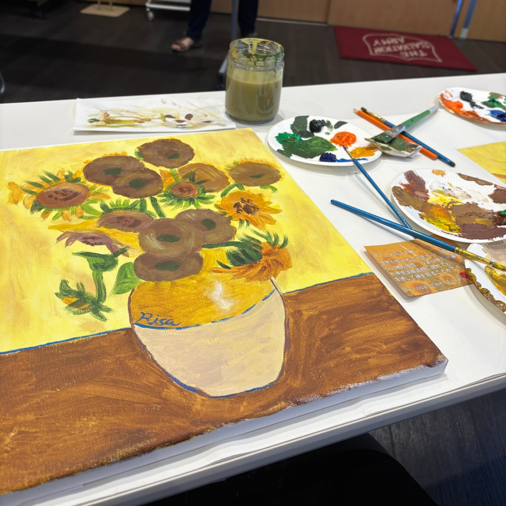
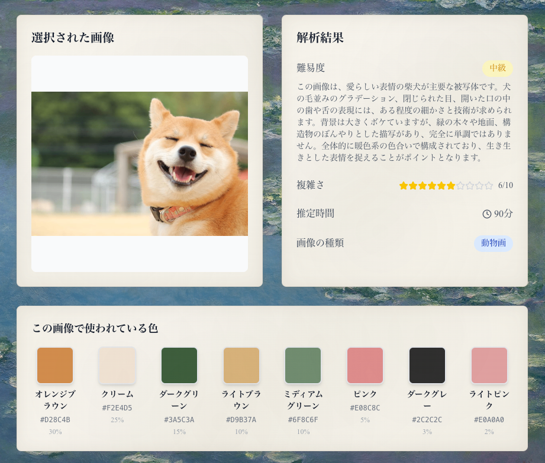
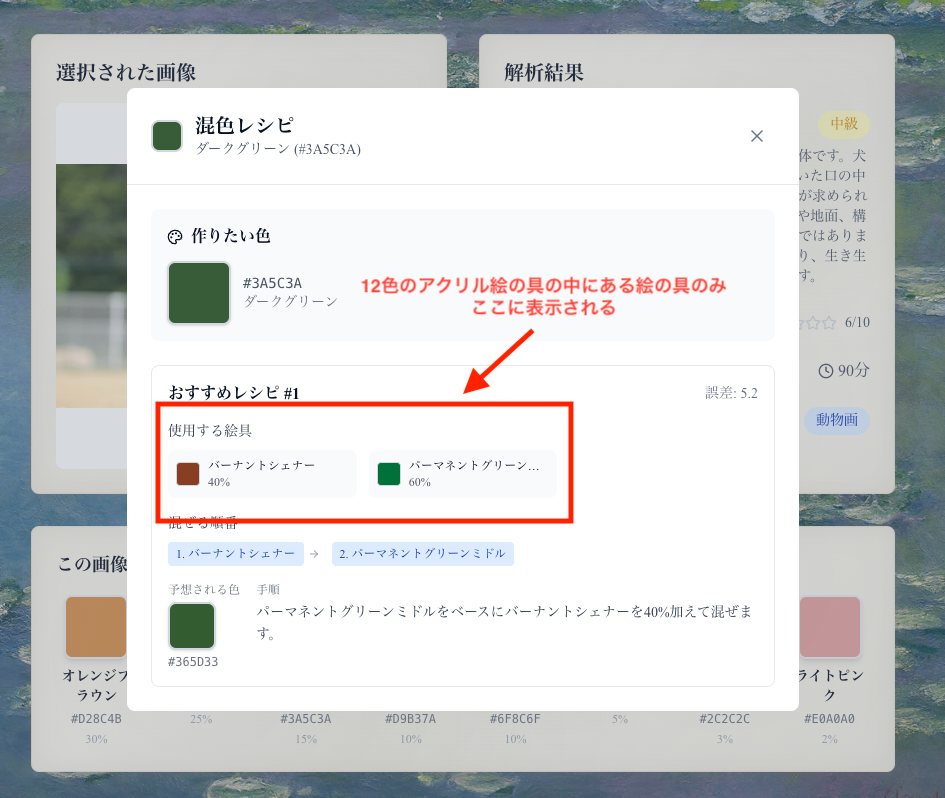
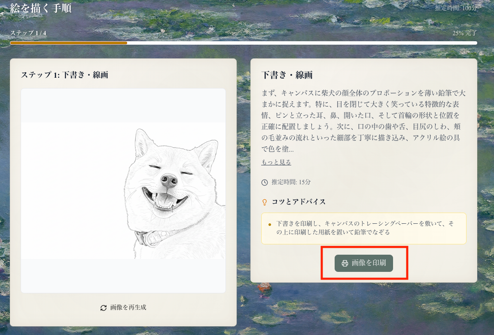
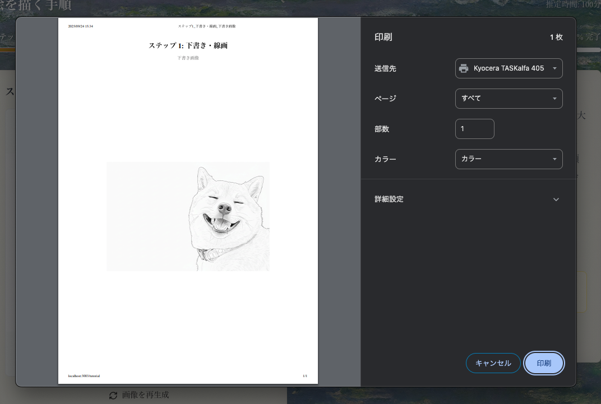
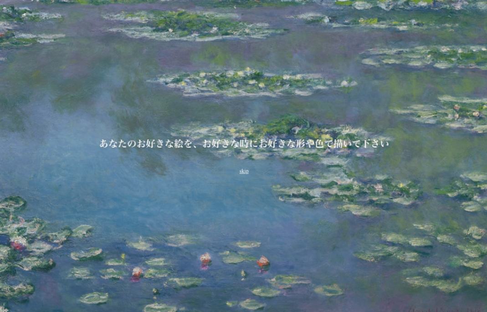
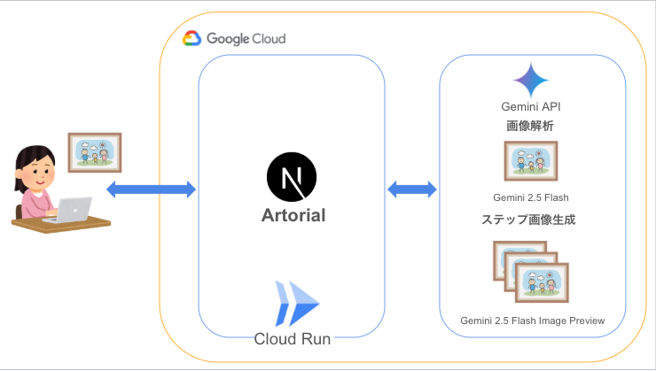

#  はじめに

今回、[第3回 AI Agent Hackathon with Google Cloud](https://zenn.dev/hackathons/google-cloud-japan-ai-hackathon-vol3)に参加させていただきました！

このアプリをきっかけに、絵を描く楽しさを知っていただけたら嬉しいです！  
それでは、私が作ったアプリについて詳しくご紹介していきます！

#  アプリを作ろうと思った背景

私は月に一度、絵を描くワークショップに参加しています。  
ワークショップでは、絵の描き方を教えてくださる講師の方と数人の参加者の方と一緒にワインを飲みながら2時間ほど使って絵を描いています。

絵を描いている時は、そのことに集中しているので、日々のストレスや不安なことを忘れてリラックスした状態になります。  
また、絵を完成させることにより自尊心が高まり、達成感も得ることができます。

そんな時間が好きで、私は何度が参加していたのですが、そのワークショップの**料金が1回8,000円と高額** なのと、**決まった時間に講師が決めた絵しか描けない** というシステムでした。

それなら、自分が好きな時に好きな絵を描こうと思い、画材と絵の具を買いました。  
しかし、いざ描こうとすると**何から描いていいのか分からず** 、模写した後に**どの色をどう塗っていいのか分かりません** でした。

そこで、Artorialを開発しました。  
Artorialでは、自分が描きたい画像をアップロードすると、それに合わせてAIが描き方を教えてくれるというものです。  
それにより、いつでもどこでも自分の好きな題材で絵が描けるようになりました。

さらに、ワークショップでは**他の参加者の作品と自分の作品を比べて自分のクオリティの低さに落ち込む** ことがありましたが、AIに教えてもらうことにより**周りの目を気にせず、さらに集中とリラックスが出来る** ようになりました。

Artorialを使って、絵を描くことで通して日々を充実させていきましょう！  

#  デモ動画

<https://youtu.be/BZfg-Zhf3Js>

#  プロジェクトが対象とするユーザー像と課題、課題へのソリューションと特徴をまとめた説明

##  ユーザー像

  * 日々のストレスや不安を抱えており、**趣味や創作活動でリフレッシュしたい人**
  * 絵を描くことに興味があるが、**ワークショップに行ってたくさんの人がいる中で絵を描くのが難しい人**
  * Youtubeやワークショップに、**自分の描きたい題材が無い人**
  * ワークショップの**金額が高額で、中々踏み込めない人**
  * **自分のペースで気軽に絵を楽しみたい** と考えている人

##  ユーザーの課題に対してのソリューション

###  💭初心者だと「何から描けばいいのか」「どう色を塗ればいいのか」が分からず挫折してしまう

好きな画像をアップロードすると、初めにGeminiが難易度と使用するカラーを表示し、その後絵の描き方をステップごとに表示し、ユーザーが迷うことなく絵を描くことができます。

###  💭ワークショップは料金が高く、気軽に参加しづらい

Geminiの画像生成は一枚約5円なので、かなり安価に学ぶことができます。

###  💭講師が題材と開催時間を決めるため、自分の好きな時に好きな絵を描けない

自宅で好きな時間に、自分の描きたい題材で制作が可能です。ご自身で描いてみたい絵の画像をアップロードするだけで初心者でも絵を簡単に描くことができます。

###  💭他人の作品と比べてしまい、自信をなくすことがある

AIが教えてくれるため他人と比べることもがなく、リラックスしながら絵を描くことができます。自分の中で納得した絵を描けたならそれで大成功だと思います。

##  既存の解決策

既存の解決策（オンライン講座、YouTube、絵画教本など）は存在しますが、

  * 題材を自分の好みに合わせられない(YouTube、絵画教本)
  * 料金が高額(オンライン講座)

といった限界があり、**自分の好きな題材を、自分のペースで、安価に初心者でも無理なく描ける仕組み** は十分に提供されていません。  
ここに本サービスの新規性があります。

##  Artorialの特徴

###  ❤️‍🔥好きな画像・好きなタイミングで制作できる

PC一台と描きたい画像と材料があれば、好きな時に、自分が描きたいものを描きたい時間に描けます。ご自身のペットの絵など、ワークショップやYoutubeには無い題材を描いてみるのもいいかもしれません。

###  ❤️‍🔥AIが手順を教えてくれる

下書きから色塗りまでステップをGeminiが生成します。初心者が一番難しい色の作り方は、事前にこちらの市販の12色パレットをベースにどのように混ぜたら見本の色になるか教えてくれるように実装しました。これで、どの色をどう混ぜたら画像のような色になるのかが分かります。  
<https://www.turner.co.jp/brand/acrylgouache/ag-12c/>

###  ❤️‍🔥下書きを印刷できる

下書きを印刷できるようにしました。これで、トレーシングペーパーでキャンバスか紙に写し書きをしてから色を塗ることができます。

###  ❤️‍🔥AIは提案してくれるだけで、それ通りに描かなくてもいい

人目があると、どうしても見本通りに描かないといけないと思ってしまいますが、AIが教えてくれるので、自分が好きな色で、好きな形でアレンジして描いて大丈夫です。

###  ❤️‍🔥リラックスして描けるように、アプリのデザインを柔らかく

リラックスして描くことを目的としているので、AIでモネ風のデザインを生成してもらい背景を実装しました。そして、オンボーディングやローディング画面の時に、1行ずつの文字を表示し、リラックスを促すような言葉掛けをたくさん入れました。この画面が表示されている間に画像の分析や手順生成を行っています。  

#  システムアーキテクチャ図

**技術構成**

  * Frontend: Next.js
  * Backend: Next.js
  * AI: Gemini API 
    * 画像解析: Gemini 2.5 Flash
    * 画像生成: Gemini 2.5 Flash Image Preview

今回はDBを持たない設計にしました。管理コストがかかるからです。  
書いた絵のSNS共有機能などはつけませんでした。人に見てもらうものではなく、自分自身が納得していたらそれでいいからです。

#  今後の展望

今後の開発で、以下の内容を実現していきたいです。

  * 色の配合を、自分の持っている絵の具でカスタマイズできるようにする
  * 水彩・色鉛筆など画材ごとの描画ステップ拡張
  * 風景画や抽象画などの画像のステップ画像の生成の強化
  * まだ画像生成が不安定なので、安定性のある画像生成ができるよう強化
  * 肌の色の後に目を塗るなどの工程ごとの画像生成ができるよう強化
  * 生成した手順を保存できるようにDBの作成

#  さいごに

私にとっての、「現実を豊かにする」は「日々の生活を充実させる」ことなので、今回のアプリを開発しました。  
私のように、小学生の時は絵を描くのが好きだったけど、大人になって描くこともなくなり、たまにリフレッシュとして自分で気軽に書いてみたいな！という方に届いたら嬉しいです。  
AIでクオリティの高い絵がたくさん生成できる時代になりましたが、ここは一度、自分の手で何かを作る楽しさをもう一度味わってみるのはいかがでしょうか。
