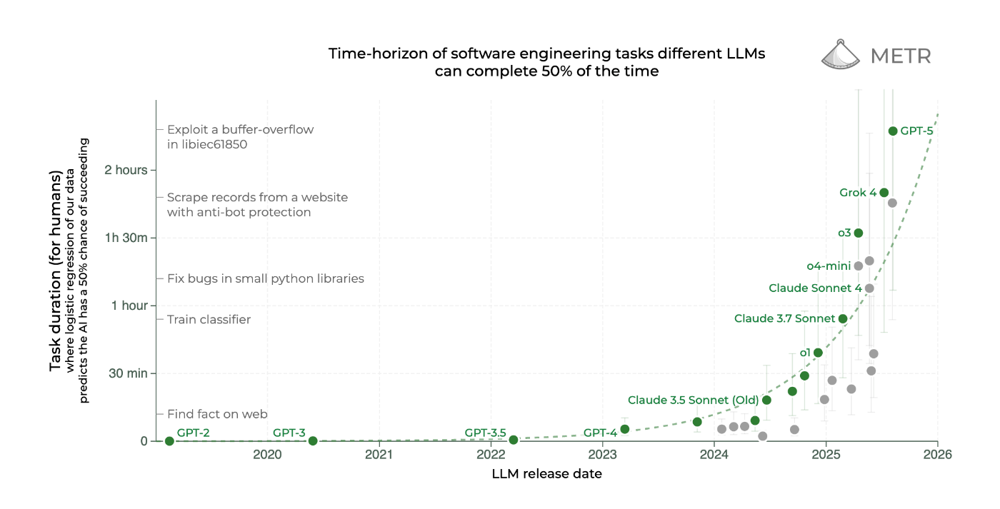
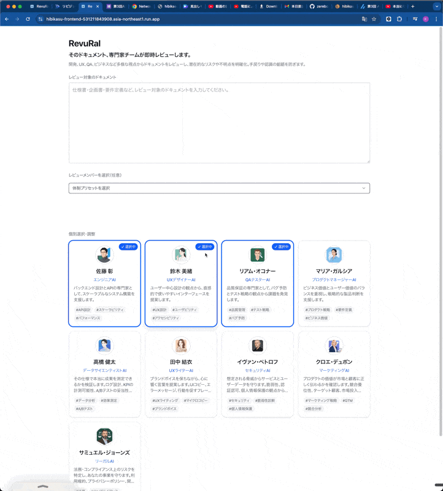
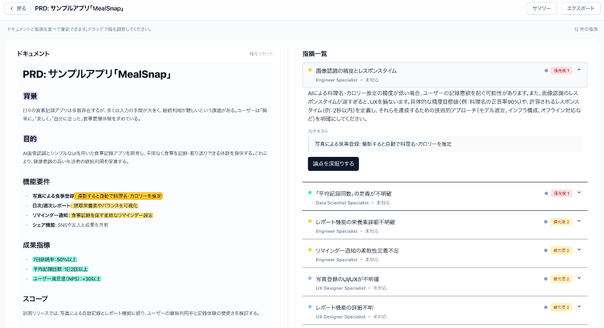
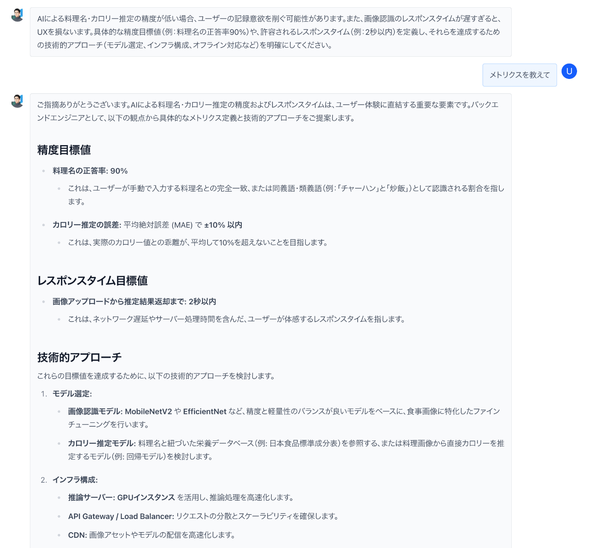
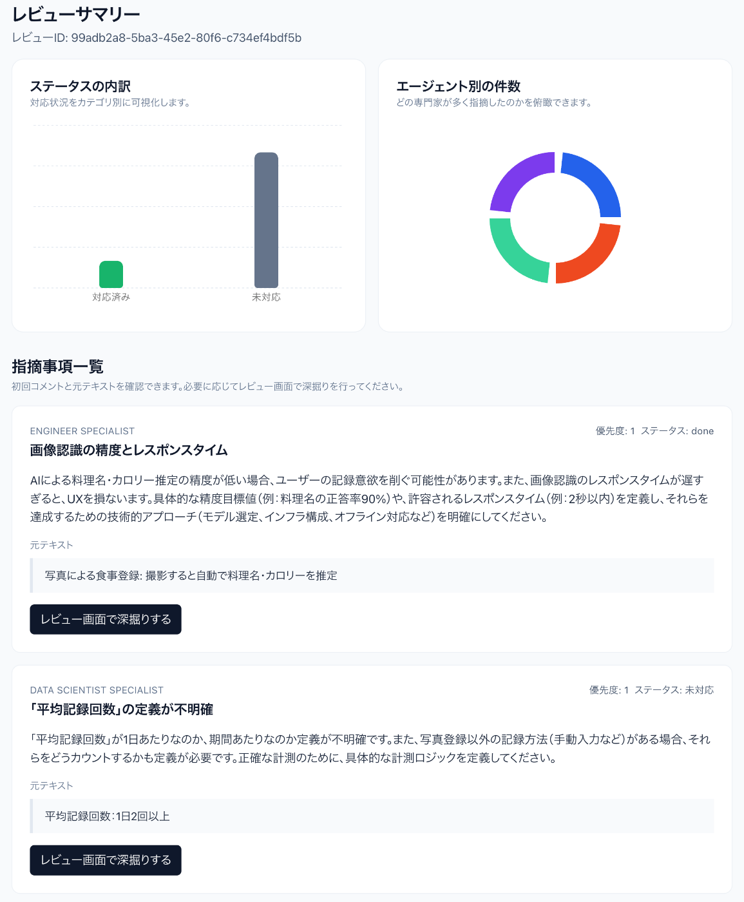

!

このブログは、第3回AI Agent Hackathon with Google Cloudの成果物 "RevuRal"の紹介記事です

<https://youtu.be/uLOgSsFtFyY?si=KTLAQmg30rvSi7wk>

##  背景: AIで、仕事は劇的に速くなる…はずだった。

生成AIの進化は、まさに日進月歩です。  
最近、AIの能力を測る新しい指標として「AIが自律的に完遂できるタスクの長さ」が注目されています。METRの調査によれば、このタスクの長さは、約7ヶ月ごとに2倍になるという驚異的なペースで伸びています。

<https://metr.org/blog/2025-03-19-measuring-ai-ability-to-complete-long-tasks/?utm_source=chatgpt.com>

>   
>  <https://metr.org/blog/2025-03-19-measuring-ai-ability-to-complete-long-tasks> より引用

この進化は、仕様書からソースコードまで、あらゆる生成タスクに及びます。だからこそ私たちは、「少人数チームでも圧倒的なスピードで開発できる時代が来た」と期待したのです。

しかし、多くの現場で今、“速度の逆転現象”が起きています。AIによって加速されたアウトプット速度に、チームの生産性が追いつくことが困難になってしまっているのです。

その中のうち、大きな原因は、AIが生み出した「生成物の山」によって引き起こされた、**人間による「レビュー疲れ」です** 。

##  課題: なぜ、私たちは「レビュー疲れ」に陥ったのか？

AIはたしかに大量のテキストを生成します。しかし、そのアウトプットには「責任」がありません。

  * **意図が不明なコード**
  * **もっともらしい嘘（ハルーション）**
  * **見過ごされたセキュリティリスク**

AIが生成したアウトプットを検証し、プロダクトに組み込む最終的な意思決定を下すのは、私たち人間の役割です。しかし、その結果として専門家たちはAIが量産したアウトプットのチェックに追われ、本来の創造的な仕事から時間を奪われています。

この「AIによる作業増」は、単なる体感ではありません。フリーランスプラットフォームUpWorkが2024年8月に実施した調査では、実に77%もの従業員が「AIツールによって生産性が落ちた、または作業量が増えた」と回答しています。

<https://www.businessinsider.com/ai-workers-productivity-survey-2024-8>

皮肉なことに、レビューの負担が増す一方で、AIがもたらす競争の激化は、より多角的で質の高いレビューをこれまで以上に求めています。

技術的な実現性、UXの妥当性、セキュリティ、ビジネスインパクト…。これら全ての視点を網羅できる専門家チームを、必要な時に即座に集めることなどは困難を極めます。

ただでさえ多忙な専門家の時間を確保するのは難しく、さらに生産年齢人口が減少していく日本では、こうした人材の採用や育成はますます困難になっていきます。

##  レビューとの、新しい付き合い方

この問題を解決するため、私たちは少し違う角度から考えてみることにしました。  
目指したのは、今あるレビュープロセスを少し速くするような、小手先の改善ではありません。

私たちが本当に変えたいのは、ものづくりにおける「レビュー」との向き合い方そのものです。  
そこで生まれたのが、AIレビューチーム『RevuRal』です。

『RevuRal』は、単なるチェックツールではありません。これまで大切だけど、負荷が高く大変だったレビューという行為を、もっと前向きで、創造性を高めるための力強い味方に変えることが出来ると信じています。

##  専門家AIチームができること

『RevuRal』を使えば、あなたのチームは、まるで頼れる専門家チームがすぐそばにいるかのように、レビューを進めることができます。

###  1\. 多角的な視点を、一瞬で。

ドキュメントを貼り付ければ、エンジニア、UXデザイナー、QAといった専門家AIたちが、それぞれの視点から抜け漏れや改善点を瞬時に指摘します。もう、関係者のスケジュール調整に頭を悩ませる必要はありません。ドキュメントに応じた必要な人材を即座にアサインできます。

またレビューした観点は、一覧化され、優先度順に並べられます。言及している箇所にはハイライトが引かれ、どこに指摘がなされているかが、すぐにわかります。

###  2\. 納得いくまで、対話で深掘り。

「なぜこれが問題なの？」「他の選択肢は？」── 気になる点は、AIとの対話で納得いくまで掘り下げられます。AIは、あなたの思考を整理し、より良い結論へ導くための心強いパートナーになります。

###  3\. 議論を、チームの資産に。

全てのレビューと対話の履歴は、サマリーとして記録されます。それは単なるログではなく、チームが「なぜこの結論に至ったのか」を示す、未来の自分たちを助ける貴重な“意思決定の記録”へと変わります。  

##  システムアーキテクチャとプロダクトの説明

###  Revuralの全体像

RevuRal は「専門的なドキュメントをを投入すると、多視点エージェントが数秒でレビュー結果を返す」ことを目指した AI レビュー・パネルです。フロントエンド（Next.js）とバックエンド（FastAPI）は Cloud Run 上の独立サービスとして動作し、Gemini 2.5 Flash Lite と Google ADK を組み合わせて専門家エージェントをオーケストレーションします。

  * **フロントエンド (Next.js 15)** : ユーザーは PRD テキストをアップロードし、レビュー進行状況をリアルタイムに確認できます。Cloud Run バックエンドの HTTPS エンドポイントに直接アクセスします。
  * **バックエンド (FastAPI)** : `/reviews` で ドキュメントを を受け付け、Google ADK を通して多数のAIエージェントの並列レビューを実行できます。フロントエンドからポーリングを受け、レビューが生成され次第返却するようなしくみになっています。
  * **Gemini + Google Agent Develop Kit(ADK)** : `gemini-2.5-flash-lite` を共通モデルとして使用しています。専門家エージェントの並列実行、結果の集約、ダイアログ応答などを ADK のエージェントパターンとセッション管理で構築しています。

システムアーキテクチャ図

###  フロントエンドのデザイン設計

エージェントからの大量のレビューが来ても、情報量に圧倒されないように情報整理に気を付けました。  
ドキュメントが表示される箇所と、レビューが表示される箇所は、ドラッグで表示サイズを調整することが出来ます。

また、必要な観点だけ注目できるようにアコーディオンで関係ない箇所は閉じれるように情報を整理しました。

また,IDEやNotionのように画面幅目一杯に表示することで、文字サイズを極端に小さくしすぎず、大量の情報を表示することが出来ています。

###  ADKの活用

今回はエージェントの統合・呼び出しのためにGoogle Agent Develop Kit(ADK)を全面的に活用しています。  
フロントから選択されたAIレビュワーを`ParallelAgent`を使い、並列に呼び出し、それらが生成した構造化されたレビュー結果一覧をまとめてユーザーに返しています。
    
    
        # 1) Specialists with explicit output keys defined via shared config
        review_agents = create_specialists_from_config(
            list(SPECIALIST_DEFINITIONS),
            model=model,
        )
    
        # 2) Run all specialists concurrently; their structured outputs persist via output_key.
        specialists_parallel = ParallelAgent(
            name="ParallelSpecialists",
            sub_agents=cast(list[BaseAgent], review_agents),
            description="Executes specialist reviews concurrently.",
        )
    
        merger = FinalIssuesAggregatorAgent(
            name="IssueAggregatorMerger",
            description="Aggregates specialist outputs deterministically.",
        )
    
        # 5) Combine them in a SequentialAgent pipeline
        pipeline = SequentialAgent(
            name="ReviewPipelineWithTools",
            sub_agents=[specialists_parallel, merger],
            description=("Coordinates specialist agents in parallel and deterministic aggregation."),
        )
    

チャットAIは別でAgentをたて、Issueをレビューした人格のAIに対話をさせることによって、コンテキストを引き継いだまま、深い議論を行うことが出来ます。

###  まとめ

AIが単純作業を代替する今、私たち人間に求められるのは、より本質的な問いを立て、質の高い意思決定を下すことです。『RevuRal』は、その知的生産のプロセスに寄り添います。

####  おまけ...

本当に提出ギリギリで技術面を記事で深掘れませんでした...!  
FastAPIの裏側にADKを立てるところなど、色々工夫したのでまた紹介したいです！では〜
